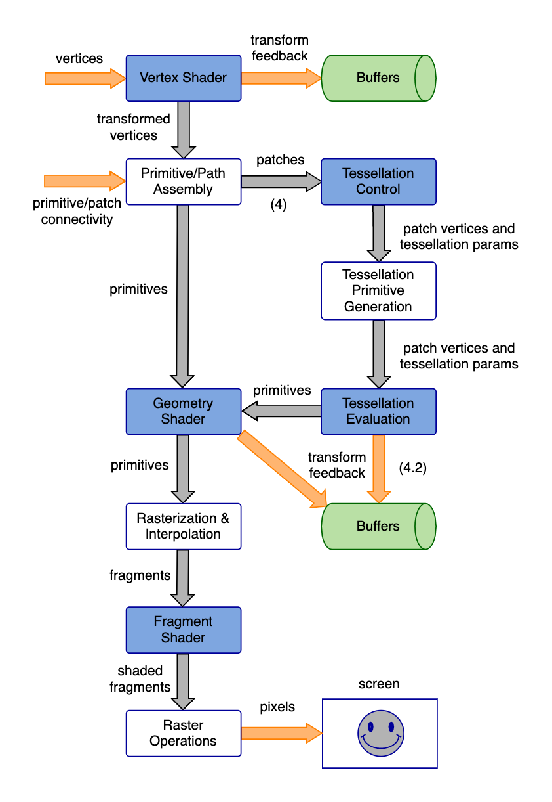

# GLSL Tutorial - 파이프라인(OpenGL 3.2 - OpenGL 4.2)

| [목차](../README.md) | 이전: | 다음: [버텍스 셰이더](../02_vertex_shader/02_vertex_shader.md) |
| :------------------- | ----: | -------------------------------------------------------------: |

아래 그림은 OpenGL(3.2 버전 이상) 파이프라인의 간략한 다이어그램입니다. 다음 장에서 각 단계에 대해 설명할 것입니다. 괄호 안의 숫자는 파이프라인의 일부 경로에서 요구하는 OpenGL 버전입니다.

| [목차](../README.md) | 이전: | 다음: [버텍스 셰이더](../02_vertex_shader/02_vertex_shader.md) |
| :------------------- | ----: | -------------------------------------------------------------: |

## 출처

http://www.lighthouse3d.com/tutorials/glsl-tutorial/pipeline33/
