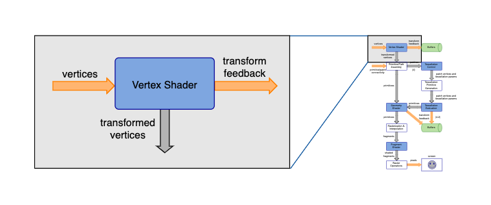

# GLSL Tutorial - 버텍스 셰이더

|[목차](../README.md)|이전 장: [간략한 파이프라인 다이어그램](../01_pipeline/01_pipeline.md)|다음 장: [프리미티브 어셈블리](../03_primitive_assembly/03_primitive_assembly.md)|
|:--|--:|--:|



버텍스 셰이더는 한 번에 한 버텍스 씩, 각 버텍스에서 실행됩니다. 셰이더에는 그래픽 프리미티브를 구성하는 다른 버텍스에 대한 정보가 없으며, 버텍스가 속한 프리미티브의 타입이 무엇인지 모릅니다. 셰이더는 하나의 입력 버텍스 당 하나의 출력 버텍스를 내보냅니다.
각 버텍스는 사용자가 정의한 입력 속성(input attribute) 세트를 가집니다. 예를 들어, 위치, 법선 벡터, 텍스쳐 좌표와 같은 것들이 있습니다. 또한 버텍스 셰이더에서는 uniform 변수에 접근할 수 있습니다. uniform 변수는 드로우콜 동안 모든 버텍스에서 읽기 전용 전역 변수처럼 동작합니다.

GLSL는 사용자 정의 변수뿐만 아니라 버텍스 속성(vertex attribute) 세트를 정의합니다:

```glsl
in int gl_VertexID;
in int gl_InstanceID;
```

`gl_VertexID`는 속성 배열(attribute array)의 버텍스 인덱스를 참조합니다.

인스턴스를 사용할 때 셰이더는 입력 버텍스 당 n번 실행되며, n값은 `glDraw*` OpenGL 명령에서 지정 인스턴스의 수입니다. gl_InstanceID 변수는 인스턴스의 인덱스를 담고 있습니다. 인스턴스를 사용하지 않는다면 이 변수의 값은 항상 0입니다.

버텍스 셰이더는 입력 속성을 받고 그 속성들을 계산하여 버텍스를 출력합니다. 버텍스 셰이더에서 사용할 수 있는 빌트인 출력 속성은 다음과 정의되어 있습니다:

```glsl
out gl_PerVertex {
    vec4 gl_Position;
    float gl_PointSize;
    float gl_ClipDistance[];
};
```

이들 중 하나를 사용하는 것은 선택 사항이지만 버텍스 셰이더 이후의 고정 함수 단계에서는 `gl_Position`변수 사용을 가정합니다. 이 변수는 출력 버텍스 위치의 동차좌표를 저장합니다.

또한 셰이더는 버텍스 변수당 사용자 정의 출력을 정의할 수 있습니다.

아래에 이 기능들을 사용한 간단한 예제가 있습니다:

```glsl
#version 410

layout (std140) uniform Matrices {
    mat4 projModeViewMatrix;
    mat3 normalMatrix;
};

in vec3 position;
in vec3 normal;
in vec2 texCoord;

out VertexData {
    vec2 texCoord;
    vec3 normal;
} VertexOut;

void main()
{
    VertexOut.texCoord = texCoord;
    VertexOut.normal = normalize(normalMatrix * normal);
    gl_Position = projModeViewMatrix * vec4(position, 1.0);
}
```

위의 버텍스 셰이더에는 버텍스 당 `position`, `normal`, `texCoord` 3개의 사용자 정의 속성이 정의 되었습니다. 그리고 `Matrices` uniform 블록에는 버텍스 변환, 법선 변환에 사용되는 두 행렬이 정의 되었습니다.

버텍스 셰이더의 출력은 `texCoord`과 `normal` 2개의 사용자 정의 속성과 GLSL의 빌트인 속성인 `gl_Position`입니다. 출력 변수가 이름 있는 블록으로 묶이는 것에 주의하세요.

출력은 `main` 함수에서 계산됩니다. 모든 타입의 셰이더에는 반드시 `main` 함수가 존재합니다. 그리고 C 프로그램과 유사한 방식으로 다른 추가 함수들을 정의할 수 있습니다.

### 성능에 관한 참고 사항.

성능적인 측면에서, 마지막으로 처리된 n개의 버텍스 출력을 저장하는 버텍스 캐시라는 것이 있습니다. 새 버텍스가 처리되기 전에 버텍스 캐시의 인덱스와 새 버텍스의 인덱스를 비교합니다. 해당 인덱스가 버텍스 캐시에 있다면, 이전에 처리된 각 데이터를 추가 처리없이 다음 파이프라인으로 보냅니다.

버텍스 캐시를 활용하면 triangle strip과 triangle fan에서처럼 명시적 또는 암시적으로 인덱스를 사용하여 성능을 개선할 수 있습니다. 예를 들어, triangle strip에서 새로운 삼각형 당 최대 하나의 버텍스가 처리됩니다. 정삼각형에서 인덱스를 사용할 경우, 이득을 계산하기 어렵습니다. 버텍스 캐시 히트를 증가시키기 위해 인덱스가 버텍스 데이터의 재구성을 요구할 수 있습니다.

버텍스 데이터가 strip이 아닌 경우, strip 또는 strip 세트로 변환될 수 있습니다. NVIDIA에서 이와 같은 처리를 수행하는 NVTriStrip라는 툴을 만들었습니다. 이 툴은 인덱스의 배열을 받고 가능한 한 큰 strip의 생성을 시도합니다. 다른 접근법으로, Tom Forsyth 알고리즘(LRU 알고리즘을 사용하는 버텍스 캐시 기반)은 GL_TRIANGLES 모드를 유지한 채로 히트를 증가시키기 위해 인덱스 데이터를 재구성합니다. Tootle(Triangle Order Optimization Tool(삼각형 순서 최적화 툴))는 모델 최적화, 픽셀 오버드로우 감소, post-transform 캐시와 vertex prefetch 캐시 히트를 증가시키는 AMD 툴입니다. 후자의 개선은 버텍스 데이터 자체를 재구성하여 삼각형의 버텍스가 메모리 상에서 서로 가깝게하여 달성됩니다. Adrian Stone은 여러 알고리즘에 대해 논의하고 테스트한 [글](http://gameangst.com/?p=9)을 작성했습니다. Ignacio Castaño는 그리드에 주목하여 [글](http://www.ludicon.com/castano/blog/2009/02/optimal-grid-rendering/)을 썼습니다.

|[목차](../README.md)|이전 장: [간략한 파이프라인 다이어그램](../01_pipeline/01_pipeline.md)|다음 장: [프리미티브 어셈블리](../03_primitive_assembly/03_primitive_assembly.md)|
|:--|--:|--:|


## 출처
http://www.lighthouse3d.com/tutorials/glsl-tutorial/vertex-shader/

