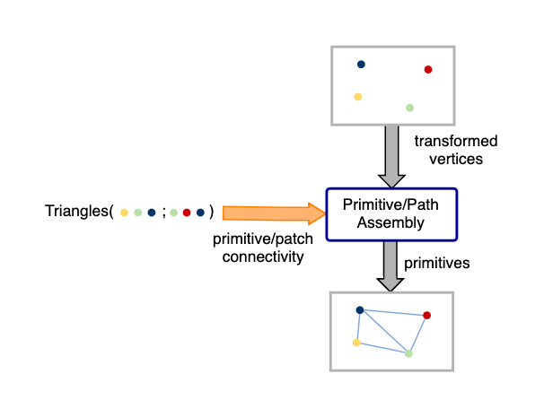
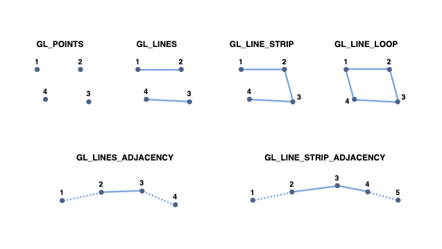
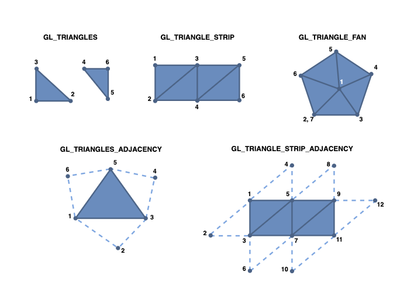

# GLSL Tutorial - 프리미티브 어셈블리

|[목차](../README.md)|이전: [버텍스 셰이더](../02_vertex_shader/02_vertex_shader.md)|다음: 테셀레이션|
|:--|--:|--:|

프리미티브 어셈블리 단계에서는 버텍스 셰이더로부터 처리된 버텍스와 어플리케이션에서 OpenGL `glDraw*` 류의 명령어에 의해 지정된 버텍스 연결성 정보(vertex connectivity information)를 입력으로 받습니다.

버텍스 연결성은 버텍스들이 프리미티브를 생성하기 위해 어떤 방식으로 연결되어 있는지를 나타냅니다. 프리미티브는 점, 선, 삼각형 또는 패치(patch)일 수 있습니다. 또한 인접 정보도 사용할 수 있습니다. 즉, 어플리케이션이 인접 프리미티브를 구성하는 버텍스를 제공할 수 있습니다. 이 정보는 오직 지오메트리 셰이더에서만 사용됩니다. 만약 지오메트리 셰이더가 활성화되지 않았다면, 인접 정보는 무시될 것입니다.

프리미티브 어셈블리는 프리미티브 또는 패치를 출력으로 생성합니다. 예를 들어, 6개의 버텍스 배열이 입력으로 들어오고, 연결성 정보를 triangles로 지정한다면 출력은 2개의 삼각형이 될 것입니다. triangle strips일 경우, 위와 동일한 6개의 버텍스는 4개의 삼각형이 출력될 것입니다.

패치는 테셀레이션 컨트롤 셰이더(tessellation control shader)에서 허용하는 프리미티브 타입입니다. 이 기능은 OpenGL 4.0이상에서 사용 가능합니다. 패치의 버텍스 수는 프리미티브의 경우처럼 고정되지 않습니다. 패치 당 버텍스 수는 1과 구현 종속 상수(implementation dependent constant) `GL_MAX_PATCH_VERTICES` 사이에서 달라질 수 있습니다.

예를 들어 GL_TRIANGLES 프리미티브 타입이라고 한다면 다음과 같은 그림으로 나타낼 수 있습니다:

가능한 입력 연결성 정보 설정, 생성된 출력, 이를 사용하는 셰이더를 다음 표에서 보여줍니다.

|glDraw 명령어|출력 프리미티브|사용 셰이더|
|--|--|--|
|`GL_POINTS`|`points`|geometry; fragment|
|`GL_LINES`|`lines`|geometry; fragment|
|`GL_LINE_STRIP`|`lines`|geometry; fragment|
|`GL_LINE_LOOP`|`lines`|geometry; fragment|
|`GL_LINES_ADJACENCY`|`lines_adjacency`|geometry|
|`GL_LINE_STRIP_ADJACENCY`|`lines_adjacency`|geometry|
|`GL_TRIANGLES`|`triangles`|geometry; fragment|
|`GL_TRIANGLE_STRIP`|`triangles`|geometry; fragment|
|`GL_TRIANGLE_FAN`|`triangles`|geometry; fragment|
|`GL_TRIANGLES_ADJACENCY`|`triangles_adjacency`|geometry|
|`GL_TRIANGLE_STRIP_ADJACENCY`|`triangles_adjacency`|geometry|
|`GL_PATCHES`|`patches`|tesellation control|

아래는 점, 선, 삼각형으로 구할 수 있는 예입니다. 인접 정보가 있는 프리미티브의 경우, 실선은 주 프리미티브를 나타내고 점선은 연결된 인접 버텍스를 나타냅니다. 그래픽스에서 순서에 주의하세요. 모든 프리미티브는 반시계 방향입니다.

패치의 기하학적 해석(geometrical interpretation)은 선형이 아니므로 여기서 다루지 않습니다. 패치에 대한 자세한 내용은 테셀레이션 장에서 다룹니다.

|[목차](../README.md)|이전: [버텍스 셰이더](../02_vertex_shader/02_vertex_shader.md)|다음: 테셀레이션|
|:--|--:|--:|

## 출처
http://www.lighthouse3d.com/tutorials/glsl-tutorial/primitive-assembly/