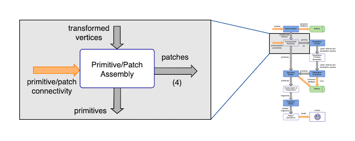

# GLSL Tutorial - 프리미티브 어셈블리

|[목차](../README.md)|이전 장: [버텍스 셰이더](../02_vertex_shader/02_vertex_shader.md)|다음 장: 테셀레이션|
|:--|--:|--:|

프리미티브 어셈블리 단계에서는 버텍스 셰이더로부터 처리된 버텍스와 어플리케이션에서 OpenGL `glDraw*` 류의 명령어에 의해 지정된 버텍스 연결성 정보(vertex connectivity information)를 입력으로 받습니다.

버텍스 연결성은 버텍스들이 프리미티브를 생성하기 위해 어떤 방식으로 연결되어 있는지를 나타냅니다. 프리미티브는 점, 선, 삼각형 또는 패치(patch)일 수 있습니다.

## 출처
http://www.lighthouse3d.com/tutorials/glsl-tutorial/primitive-assembly/