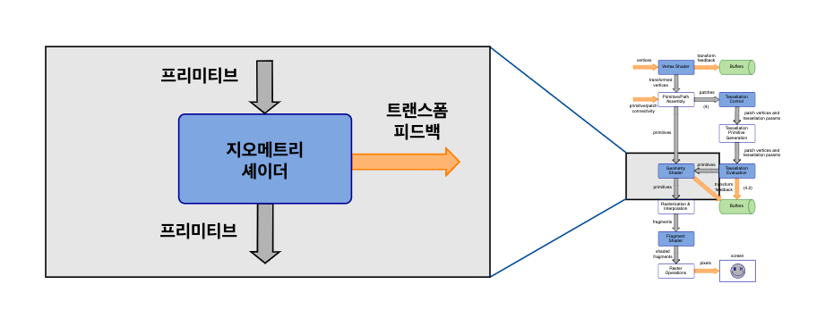

# GLSL Tutorial - 지오메트리 셰이더

| [목차](../README.md) | 이전: [테셀레이션](../04_tessellation/04_tessellation.md) | 다음: 지오메트리 셰이더 예제 |
| :------------------- | -----------------------------------------------------------------------------: | ----------------------: |

지오메트리 셰이더는 OpenGL 3.2부터 추가된 기능입니다.

지오메트리 셰이더 단계는 선택사항입니다. 지오메트리 셰이더가 존재한다면 이전 단계에서 조립된 프리미티브를 입력으로 받습니다. 지오메트리 셰이더는 strips, fans, loops는 입력으로 받지 않습니다. 지오메트리 셰이더는 조립된 프로미티브를 입력으로 받습니다. 그러므로 draw 명령어가 triangle strips를 지정한다면, 지오메트리 셰이더는 실제로는 triangles를 받습니다.

| [목차](../README.md) | 이전: [테셀레이션](../04_tessellation/04_tessellation.md) | 다음: 지오메트리 셰이더 예제 |
| :------------------- | -----------------------------------------------------------------------------: | ----------------------: |

## 출처

http://www.lighthouse3d.com/tutorials/glsl-tutorial/geometry-shader/
