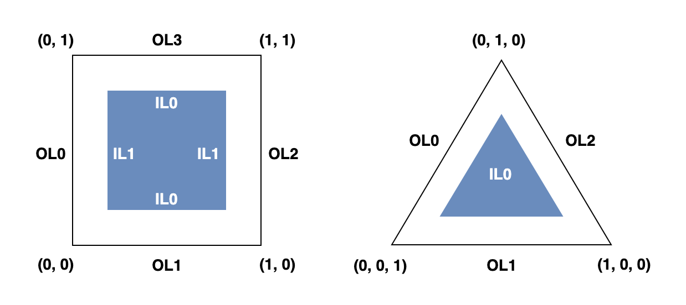

# GLSL Tutorial - 테셀레이션

| [목차](../../README.md) | 이전: [프리미티브 어셈블리](../03_primitive_assembly/03_primitive_assembly.md) | 다음: [지오메트리 셰이더](../05_geometry_shader/05_geometry_shader.md) |
| :------------------- | -----------------------------------------------------------------------------: | ----------------------: |

테셀레이션은 패치를 입력으로 받고 점, 선, 삼각형 형태의 새 프리미티브를 생성하는 그래픽스 파이프라인의 단계입니다.

패치는 버텍스 셰이더에 의해 속성이 계산되는 버텍스 배열입니다. 버텍스 셰이더는 기존과 동일하게 동작하고, 입력으로 패치 버텍스들을 받아서 새로운 버텍스들을 출력으로 내보냅니다. 테셀레이션 셰이더는 변환된 버텍스 배열, 즉 패치를 받아서 일반적으로 더 작은 프리미티브로 나눕니다.

다른 OpenGL 프리미티브 타입과 다르게, 사용자가 패치의 버텍스 수를 정의할 수 있습니다.
다음과 같이 `glPatchParameteri` 함수는 드로우 콜에서 상수로 유지되는 해당 값을 설정하는데 사용됩니다:

```glsl
glPatchParameteri(GL_PATCH_VERTICES, verticesPerPatch);
```

`verticesPerPatch`는 [1, `GL_MAX_PATCH_VERTICES`] 범위의 정수이어야 합니다. 이 상수는 `glGetIntegerv` 함수를 사용하여 구할 수 있습니다.

테셀레이션 파이프라인은 세 가지 하위 단계로 나뉩니다: 테셀레이션 컨트롤(tessellation control), 프리미티브 제너레이션(primitive generation), 테셀레이션 이벨류에이션(tessellation evaluation). 첫 번째와 마지막 하위 단계는 프로그래밍할 수 있습니다. 즉, 해당 단계들에서 사용되는 셰이더를 작성할 수 있습니다. 반면에 두 번째 단계는 고정 단계입니다.

첫 번째 단계인 테셀레이션 컨트롤 셰이더는 입력 패치의 버텍스 배열을 받습니다. 그리고 출력 패치를 구성하는 각 버텍스의 속성을 계산하고 배열에 저장합니다. 이 셰이더는 패치의 세분화 정도를 정의하는 패치 당 속성(per-patch attributes)를 구하는 역할도 합니다.

패치의 타입은 두 가지로 삼각형과 사각형이 존재합니다. 하지만, 패치의 버텍스 수는 타입과 무관하다는 것에 주의하세요. 예를 들어, 하나의 버텍스로 사각형 패치를 정의하거나, 16개의 버텍스로 베지어 패치(Bézier patch)를 정의하는 것이 가능합니다. 사실 버텍스라는 단어를 사용하면 오해의 소지가 있습니다. 단순히 데이터라고 부르는 것이 더 적절합니다.

세분화는 _테셀레이션 레벨_(tessellation levels)에 의해 제어됩니다. 테셀레이션 레벨은 0부터 `GL_MAX_TESS_THAN_GEN_LEVEL`로 설정할 수 있고, `glGenIntegerv` 함수를 호출하여 얻을 수 있습니다. 이 값은 일반적으로 64입니다.

테셀레이션 레벨은 패치의 각 면과 내부의 세분화를 제어합니다. 그러므로, 사각형 패치에서는 네 개, 삼각형 패치에서는 세 개의 외부 테셀레이션이 존재합니다. 사각형 패치에서는 두 개의 내부 테셀레이션 레벨, 삼각형 패치에서는 한 개의 내부 테셀레이션 레벨이 필요합니다.

셰이더에서 테셀레이션 레벨 설정을 생략할 수 있습니다. 이런 경우에는 기본 테셀레이션 레벨이 사용됨을 주의하세요. 기본 값은 `glGetIntegerv` 함수로 구할 수 있습니다.

다음과 같이 어플리케이션은 값을 설정하고 수정할 수 있습니다:

```glsl
glPatchParameteri(GL_PATCH_DEFAULT_OUTER_LEVEL, myDefaultOuterLevel);
glPatchParameteri(GL_PATCH_DEFAULT_INNER_LEVEL, myDefaultInnerLevel);
```

버텍스가 계산된 후에 테셀레이션 레벨이 설정되면 두 번째 단계인 프리미티브 제너레이션으로 갈 준비가 된 것 입니다. 두 번째 단계는 고정함수이며 패치 내부에서 새 버텍스의 실제 생성을 담당합니다. 그러나 이 단계는 패치에 대한 정보가 없으며 대신에 다음과 같은 좌표를 가진 템플릿 패치에서 작동합니다:

<p align="center"></p>

테셀레이션 레벨은 위와 같이 특정 영역이나 모서리에 영향을 미치도록 정의됩니다.

| [목차](../../README.md) | 이전: [프리미티브 어셈블리](../03_primitive_assembly/03_primitive_assembly.md) | 다음: [지오메트리 셰이더](../05_geometry_shader/05_geometry_shader.md) |
| :------------------- | -----------------------------------------------------------------------------: | ----------------------: |

## 출처

http://www.lighthouse3d.com/tutorials/glsl-tutorial/tessellation/
