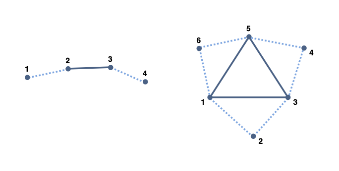

# GLSL Tutorial - 지오메트리 셰이더

| [목차](../../README.md) | 이전: [테셀레이션](../04_tessellation/04_tessellation.md) | 다음: [지오메트리 셰이더 예제](../06_geometry_shader_example/06_geometry_shader_example.md) |
| :---------------------- | --------------------------------------------------------: | ---------------------------: |

<p align="center"></p>

지오메트리 셰이더는 OpenGL 3.2부터 추가된 기능입니다.

이 단계는 선택사항입니다. 지오메트리 셰이더가 존재한다면 이전 단계에서 조립된 프리미티브를 입력으로 받습니다. 지오메트리 셰이더는 strips, fans, loops를 입력으로 받지 않습니다. 지오메트리 셰이더는 조립된 프로미티브를 입력으로 받으므로 draw 명령어에서 triangle strips로 지정하더라도, 실제로 지오메트리 셰이더는 triangles를 받습니다.

버텍스 셰이더와 다르게 지오메트리 셰이더는 작업 중인 프리미티브의 모든 정보를 가지고 있습니다. 지오메트리 셰이더는 각 입력 프리미티브에서 프리미티브를 구성하는 모든 버텍스에 접근할 수 있습니다. 만약 지정되어 있다면, 인접 정보에도 접근할 수 있습니다.

사용가능한 지오메트리 셰이더의 입력 프리미티브는 다음과 같습니다:

- `points (1)`
- `lines (2)`
- `lines_adjacency (4)`
- `triangles (3)`
- `triangles_adjacency (4)`

괄호 안의 숫자는 프리미티브 당 버텍스의 수를 나타냅니다.

지오메트리 셰이더의 입력은 [프리미티브 어셈블리 색션](../03_primitive_assembly/03_primitive_assembly.md)에 설명된 대로 OpenGL draw 명령어의 프리미티브와 일치해야 합니다. 인접 정보를 포함한 `lines_adjacency` 또는 `triangles_adjacency` 프리미티브를 받는 경우, 버텍스의 순서는 다음과 같습니다:

<p align="center"></p>

사용가능한 출력 프리미티브의 타입은 다음과 같습니다:

- `points`
- `line_strip`
- `triangle_strip`

입력과 출력은 일치하지 않아도 됩니다. 예를 들어, 지오메트리 셰이더는 `triangles`를 받아서 `points` 또는 `line_strip`을 출력할 수 있습니다.

지오메트리 셰이더의 출력은 0개 이상의 프리미티브일 수 있습니다. 예를 들어, triangle strip을 출력한다면, 지오메트리 셰이더는 각각 두 개의 triangle을 가진 strip 세 개를 출력할 수 있습니다. 입력 프리미티브는 셰이더 실행 후에 항상 제거됩니다.

지오메트리 셰이더가 특정 입력 프리미티브에 대한 출력 프리미티브를 생성하지 않도록 했다면 사실 상, 컬링과 비슷한 작업을 한다는 것을 의미합니다.

또한 지오메트리 셰이더가 입력 프리미티브 당 여러 개의 프리미티브를 출력할 수 있다는 의미이기도 합니다. 하지만 지오메트리 셰이더는 지오메트리의 대량 증폭을 제공하도록 설계되지 않았습니다. 예를 들어, 테셀레이션 목적에는 적합하지 않습니다.

입력과 출력 프리미티브 타입은 셰이더에서 `layout` 한정자(qualifier)를 사용하여 선언되어야 합니다. 입력 프리미티브 타입으로 `triangles`와 출력 프리미티브 타입으로 `line_strip`을 가정한다면, 셰이더 코드는 다음과 같습니다:

```glsl
// geometry shaders require at least version 1.5
#version 150

layout (triangles) in;
layout (line_strip, max_vertices = 4) out;
...
```

`max_vertices`는 지오메트리 셰이더가 출력할 버텍스의 수를 제한합니다. 사실입니다! 정해진 수보다 더 많은 버텍스를 출력하려고 한다면, 초과된 버텍스는 다음 파이프라인으로 보내지지 않을 것입니다.

OpenGL 4.0부터 지오메트리 셰이더는 각 입력 프리미티브에서 1회 이상 호출될 수 있습니다. 호출 횟수는 입력 layout 한정자에 의해 결정됩니다. 지오메트리 셰이더가 각 입력 프리미티브에서 두 번 실행되는 예는 다음과 같습니다:

```glsl
#version 400

layout (triangles, invocations = 2) in;
layout (line_strip, max_vertices = 4) out;
...
```

layout에 `invocation`이 없다면 셰이더는 각 입력 프리미티브에서 한 번만 실행될 것입니다.

버텍스 셰이더에서 출력으로 정의된 사용자 정의 버텍스 속성뿐만 아니라 지오메트리 셰이더는 uniform 변수와 텍스처에 접근할 수 있습니다.

사용 가능한 빌트인 변수는 다음과 같습니다:

```glsl
in gl_PerVertex {
    vec4 gl_Position;
    float gl_PointSize;
    float gl_ClipDistance[];
} gl_in[];

in int gl_PrimitiveIDIn;
// only for OpenGL 4.0+
in int gl_InvocationID;
```

지오메트리 셰이더의 `gl_PerVertex` 구조체 입력들은 버텍스 셰이더의 이름이 같은 출력 구조체 출력들과 일치하지만, 지오메트리 셰이더의 `gl_PerVertex` 입력 구조체는 배열 형식입니다. `gl_PrimitiveID` 변수는 Draw\* 류의 OpenGL 명령어에 의해 생성된 프리미티브의 인덱스를 저장합니다.

지오메트리 셰이더는 개념적으로 프리미티브를 출력하지만 실제로는 버텍스를 출력하는 것과 같습니다. 출력 프리미티브가 triangle이면, 지오메트리 셰이더는 세 버텍스의 속성을 작성해야 합니다. 그리고 출력 layout에 따라서 버텍스들이 프리미티브로 조립됩니다. 각 버텍스에서 사용 가능한 빌트인 변수는 다음과 같습니다:

```glsl
out gl_PerVertex {
    vec4 gl_Position;
    float gl_PointSize;
    float gl_ClipDistance[];
};

out int gl_PrimitiveID;
out int gl_Layer;
// only for OpenGL 4.1+
out int gl_ViewportIndex;
```

버텍스 셰이더와 마찬가지로, `gl_Position`은 선택사항입니다. 하지만 다음 단계에서 보간 목적으로 사용할 수 있습니다. `gl_PrimitiveID`는 적어도 _provoking_ 버텍스에 대해 작성되어야 합니다. `gl_Layer`와 `gl_ViewportIndex`가 지정된다면, 프리미티브의 모든 버텍스가 동일한 값으로 작성되어야 합니다. 지오메트리 셰이더에서 `gl_ViewportIndex`나 `gl_Layer`를 지정하지 않는다면, 이 값들은 0이 됩니다.

지오메트리 셰이더는 프리미티브별로 그리기 위한 레이어를 지정할 수 있습니다. 이를 통해 지오메트리 셰이더는 다수의 프리미티브를 지정하고 다른 레이어로 보낼 수 있습니다. 레이어화된 렌더링은 프레임 버퍼의 사용의 의미하며, 그렇지 않으면 `gl_Layer` 값이 무시됩니다. 레이어화된 렌더링 사용의 예는 단일 패스에서 큐브 맵의 6개 면을 렌더링하는 것입니다.

OpenGL 4.1부터 지오메트리 셰이더는 출력할 뷰포트를 선택할 수 있습니다. 이 기능으로 다수의 뷰를 동시에 렌더링할 수 있습니다.

빌트인 변수뿐만 아니라, 지오메트리 셰이더는 사용자 정의 변수를 선언하고 사용할 수 있습니다. 이전의 셰이더와 마찬가지로 지오메트리 셰이더의 출력은 트랜스폼 피드백을 사용하여 버퍼로 리다이렉션될 수 있습니다.

| [목차](../../README.md) | 이전: [테셀레이션](../04_tessellation/04_tessellation.md) | 다음: [지오메트리 셰이더 예제](../06_geometry_shader_example/06_geometry_shader_example.md) |

## 출처

http://www.lighthouse3d.com/tutorials/glsl-tutorial/geometry-shader/
