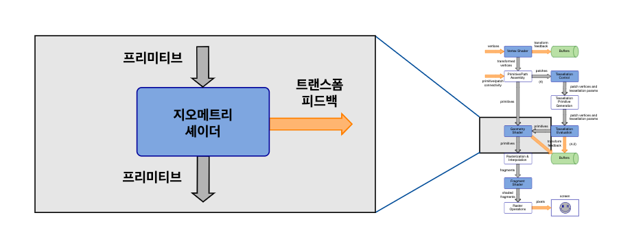

# GLSL Tutorial - 지오메트리 셰이더

| [목차](../../README.md) | 이전: [테셀레이션](../04_tessellation/04_tessellation.md) | 다음: 지오메트리 셰이더 예제 |
| :------------------- | -----------------------------------------------------------------------------: | ----------------------: |

<p align="center"></p>

지오메트리 셰이더는 OpenGL 3.2부터 추가된 기능입니다.

지오메트리 셰이더 단계는 선택사항입니다. 지오메트리 셰이더가 존재한다면 이전 단계에서 조립된 프리미티브를 입력으로 받습니다. 지오메트리 셰이더는 strips, fans, loops는 입력으로 받지 않습니다. 지오메트리 셰이더는 조립된 프로미티브를 입력으로 받습니다. 그러므로 draw 명령어가 triangle strips를 지정한다면, 지오메트리 셰이더는 실제로는 triangles를 받습니다.

버텍스 셰이더와는 반대로 지오메트리 셰이더는 작업 중인 프리미티브의 모든 정보를 가지고 있습니다. 각 입력 프리미티브에서, 지오메트리 셰이더는 프리미티브를 구성하는 모든 버텍스에 접근할 수 있습니다. 만약 지정되어 있다면, 인접 정보에도 접근할 수 있습니다.

사용가능한 지오메트리 셰이더의 입력 프리미티브는 다음과 같습니다:

- `points (1)`
- `lines (2)`
- `lines_adjacency (4)`
- `triangles (3)`
- `triangles_adjacency (4)`

괄호 안의 숫자는 프리미티브 당 버텍스의 수를 나타냅니다.

지오메트리 셰이더의 입력은 [프리미티브 어셈블리 색션](../03_primitive_assembly/03_primitive_assembly.md)에 설명된 대로 OpenGL draw 명령어의 프리미티브와 일치해야 합니다. 인접 정보를 포함한 `lines_adjacency` 또는 `triangle_adjacency` 프리미티브를 받는 경우, 버텍스의 순서는 다음과 같습니다:

<p align="center"></p>

사용가능한 출력 프리미티브의 타입은 다음과 같습니다:

- `points`
- `line_strip`
- `triangle_strip`

입력과 출력은 일치하지 않아도 됩니다. 예를 들어, 지오메트리 셰이더는 `triangle`를 받아서 `point` 또는 `line_strip`을 출력할 수 있습니다.

지오메트리 셰이더의 출력은 0개 이상의 프리미티브일 수 있습니다. 예를 들어, triangle strip을 출력한다면, 지오메트리 셰이더는 각각 두 개의 triangle을 가진 strip 세 개를 출력할 수 있습니다. 입력 프리미티브는 셰이더 실행 후에 항상 제거됩니다.

지오메트리 셰이더가 특정 입력 프리미티브에 대한 출력 프리미티브를 생성하지 않도록 했다면 사실 상 일종의 컬링을 수행한다는 것을 의미합니다.

또한 지오메트리 셰이더가 입력 프리미티브 당 여러 개의 프리미티브를 출력할 수 있다는 의미이기도 합니다. 하지만 지오메트리 셰이더는 지오메트리의 대량 증폭을 제공하도록 설계되지 않았습니다. 예를 들어, 테셀레이션 목적에는 적합하지 않습니다.

입력과 출력 프리미티브 타입은 셰이더에서 `layout` 한정자(qualifier)를 사용하여 선언되어야 합니다. 입력 프리미티브 타입으로 `triangles`와 출력 프리미티브 타입으로 `line_strip`을 가정한다면, 셰이더 코드는 다음과 같습니다:

```glsl
// geometry shaders require at least version 1.5
#version 150

layout (triangles) in;
layout (line_strip, max_vertices = 4) out;
...
```

`max_vertices`는 지오메트리 셰이더가 출력할 버텍스의 수를 제한합니다. 정말 그렇습니다! 정해진 수보다 더 많은 버텍스를 출력하려고 한다면, 초과된 버텍스는 다음 파이프라인으로 보내지지 않을 것입니다.

| [목차](../../README.md) | 이전: [테셀레이션](../04_tessellation/04_tessellation.md) | 다음: 지오메트리 셰이더 예제 |
| :------------------- | -----------------------------------------------------------------------------: | ----------------------: |

## 출처

http://www.lighthouse3d.com/tutorials/glsl-tutorial/geometry-shader/
