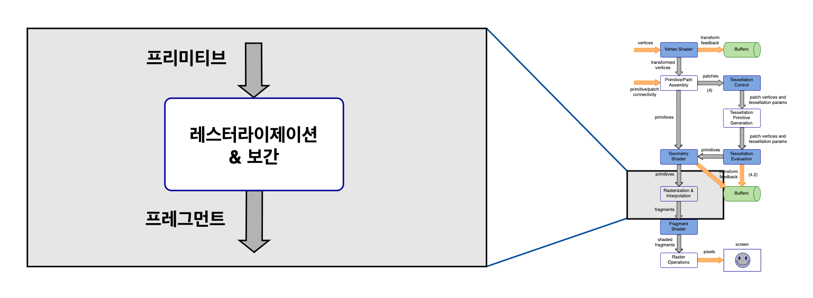
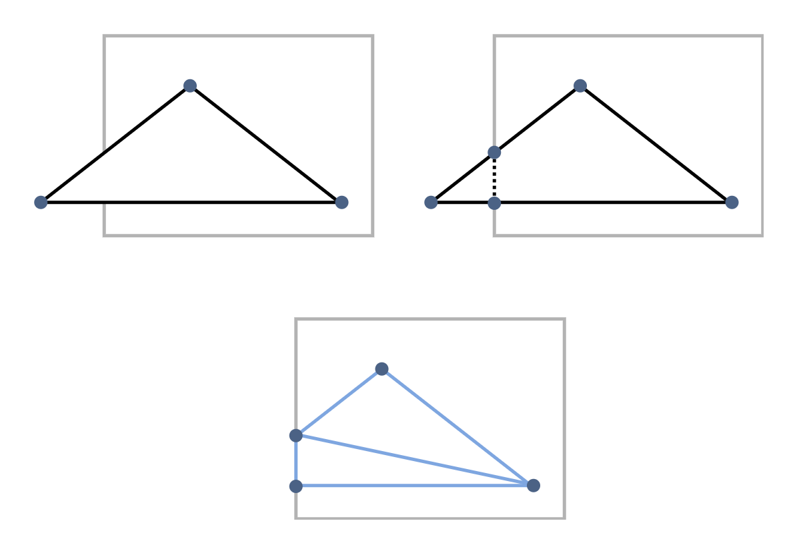
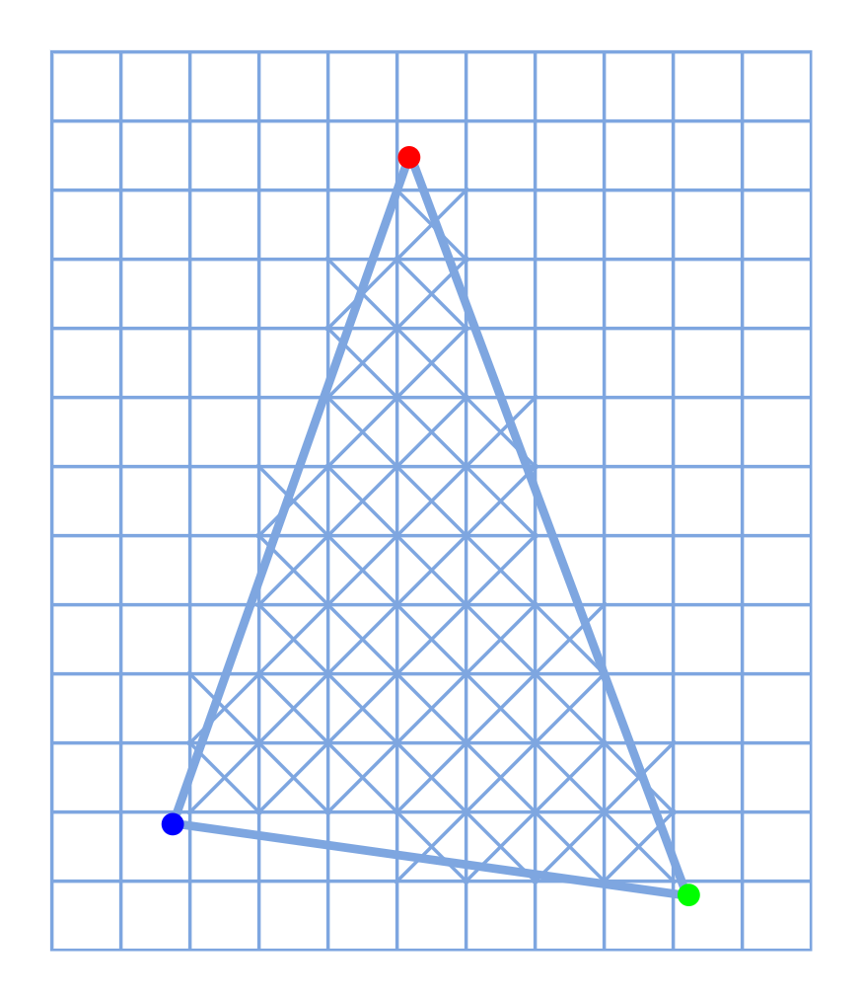
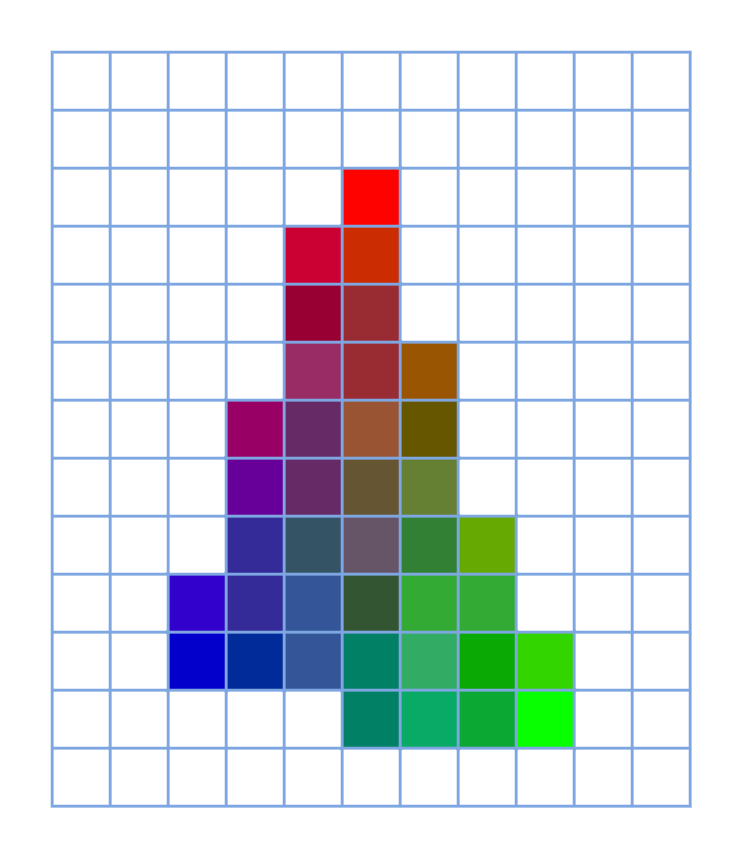

# GLSL Tutorial - 레스터라이제이션과 보간

| [목차](../../README.md) | 이전: [지오메트리 셰이더 예제](../06_geometry_shader_example/06_geometry_shader_example.md) | 다음: [프레그먼트 셰이더](../08_fragment_shader/08_fragment_shader.md) |
| :---------------------- | ------------------------------------------------------------------------------------------: | ---------------------------------------------------------------------: |

<p align="center"></p>

이번 색션에서는 그래픽스 파이프라인을 이해를 위한 두 가지 중요 개념인 레스터라이제이션(rasterizatio)과 보간(interpolation)을 다룹니다. 그래픽스 파이프라인에서 이 두 가지 단계는 고정 함수입니다. 즉, 프로그래밍을 할 수 없습니다.

하지만 레스터라이제이션이 수행되기 전에, 지금 설명할 몇 가지 작은 과정들이 있습니다. 이 과정에서 윈도우 좌표 변환을 클리핑(clipping)합니다.

**클리핑**

이 단계는 변환 버텍스가 조합된 프리미티브를 받고, 클리핑 볼륨 안쪽에 위치하는지 확인합니다. 프리미티브의 모든 부분이 클리핑 볼륨 안쪽에 위치한다면 해당 프리미티브는 변경되지 않습니다. 뷰 볼륨 밖에 있는 프리미티브는 제거됩니다. 클리핑 볼륨의 경계에서 모서리가 교차되는 프리미티브는 클리핑 됩니다.

클리핑 볼륨은 뷰 프러스텀 내부에 있는 모든 버텍스가 $(x_c,\ y_c,\ z_c,\ w_c)$ 좌표를 가지도록 뷰 프러스텀의 변환한 것입니다.

$$-w_c \leq x_c \leq w_c$$
$$-w_c \leq y_c \leq w_c$$
$$-w_c \leq z_c \leq w_c$$

버텍스의 `gl_Position` 속성은 클립 좌표를 가지며 클리핑 목적으로 테스트됩니다. 버텍스 클립 좌표는 $(x_c,\ y_c,\ z_c,\ w_c)$입니다.

버텍스가 클리핑 볼륨 경계면의 반대쪽에 위치한 모서리를 가진 프리미티브인 경우, 교차된 각 클리핑 평면에 대해 교차점에서 새로운 버텍스가 계산됩니다. 새 버텍스들은 해당 프리미티브의 일부분으로 포함되고, 클리핑 볼륨 바깥쪽의 버텍스들은 제거됩니다. 따라서 클리핑은 삼각형 프리미티브에 새 버텍스들을 추가할 수 있지만 프로그래머에게는 보이지 않습니다.

다음 그림에서 클리핑 볼륨 밖으로 일부분이 나온 삼각형이 어떻게 되는지 보여줍니다.

<p align="center"></p>

새 버텍스는 각 모서리를 따라 보간된 관련 속성을 가집니다. 플랫 셰이딩(flat shading)은 속성 선언에서 지정되며 이 경우 속성값은 모서리를 따라 일정합니다.
그러면 버텍스를 원근 분할(perspective division)이라고도 하는 정규화 장치 좌표(NDC : normalized device coordinates)로 변환할 수 있습니다. 즉, $(x_d,\ y_d,\ z_d) = (x_c/w_c,\ y_c/w_c,\ z_c/w_c)$이 됩니다.

정규화 장치 좌표로 변환하면 클립 볼륨은 모든 좌표가 -1부터 1의 범위인 3D 큐브가 됩니다(깊이 클램핑(depth clamping)이 비활성화되지 않는 한 z값의 제한이 없습니다). 그러므로, 버텍스는 깊이 클램핑할 경우 다음과 같이 클리핑 볼륨 안에 위치합니다:

$$-1 \leq x_d \leq 1$$
$$-1 \leq y_d \leq 1$$
$$-1 \leq z_d \leq 1$$

**플랫 셰이딩**

버텍스 속성 선언에서 평면(flat)을 지정할 때, 속성은 버텍스 중 하나에서 프리미티브의 나머지 모든 버텍스로 복사됩니다. 지정하지 않는다면, 프리미티브의 마지막 버텍스가 모든 다른 버텍스들의 속성값으로 결정됩니다. 이 버텍스를 _provoking_ 버텍스라고 부릅니다. OpenGL은 다음의 명령어로 처음이나 마지막 버텍스를 _provoking_ 버텍스로 지정하는 것을 허용합니다:

```glsl
glProvokingVertex(enum provokeMode);
```

_provokeMode_ 위치에 다음 값들을 지정할 있습니다: `GL_FIRST_VERTEX_CONVENTION` 또는 `GL_LAST_VERTEX_CONVENTION`(마지막 값이 기본값입니다).

**윈도우 좌표**

이제 모든 버텍스에 대해 윈도우 좌표를 계산할 수 있습니다. 윈도우 좌표는 뷰포트에 따라 달라집니다.
높이가 _h_, 너비가 _w_, 중심이 $(O_x,\ O_y)$인 뷰포트를 생각해보세요. 윈도우 좌표 안에 모든 값이 있고 단위는 픽셀입니다.

정규화 장치 좌표 $(x_d,\ y_d,\ z_d)$ 버텍스는 다음 계산으로 윈도우 좌표 $(x_w,\ y_w,\ z_w)$를 가집니다:

$$(x_w,\ y_w,\ z_w) = (x_x * (w/2) + o_x,\ y_d * (h/2) + o_y,\ (z_d * (f - n) + (n + f)) / 2)$$

**레스터라이제이션**

레스터라이제이션은 최종 이미지에서 프리미티브 부분의 픽셀 세트를 결정하는 절차입니다.

폴리곤 레스터라이제이션의 첫 단계는 방향을 결정하는 것입니다. 즉, 앞면인지 뒷면인지를 구분하는 것입니다. 컬링이 활성화되면, 적합하지 않은 방향의 삼각형은 전부 제거되고 레스터라이제이션이 종료됩니다.

올바른 방향의 삼각형의 경우, 삼각형 부분의 픽셀을 결정해야 합니다. 중심이 삼각형 경계의 안쪽에 있는 각 픽셀은 추가 절차를 위해 픽셀 세트에 추가 됩니다. 다음의 그림에서, 색깔이 있는 점들은 스크린 공간의 버텍스 위치를 나타냅니다. 버텍스가 위치한 픽셀은 삼각형을 구성하는 픽셀 세트에 포함되지 않을 수 있음을 주의하세요.

<p align="center"></p>

**보간**

다음 단계는 버텍스 속성과 각 버텍스 스크린 위치까지의 픽셀의 거리 따른 각 픽셀 속성을 계산하는 것입니다.

무게중심좌표(barycentric coordinates)은 보간 절차를 수행하는데 사용됩니다. 삼각형 $(p_a,\ p_b,\ p_c)$ 내부의 모든 점 $p$을 다음과 같이 표현할 수 있습니다:

$$p = a * p_a + b * p_b + c * p_c$$

$$a + b + c = 1$$

이라면

$$0 \leq a \leq 1$$
$$0 \leq b \leq 1$$
$$0 \leq c \leq 1$$

입니다.

세 값 $(a,\ b,\ c)$은 점 $p$ 의 무게중심좌표를 담고 있습니다. 무게중심좌표는 각 버텍스가 삼각형 내부의 한 점에 미치는 영향을 결정하는 가중치라고 볼 수 있습니다. 그리고 전에 언급했던 것처럼, 가중치의 합은 1입니다.

각 픽셀에서, 속성값은 픽셀의 중심을 나타내는 좌표인 점 $p$ 와 이전에 계산된 가중치를 고려하여 보간됩니다.
즉, 무게중심좌표와 스크린 공간에서 버텍스의 속성값입니다.

<p align="center"></p>

| [목차](../../README.md) | 이전: [지오메트리 셰이더 예제](../06_geometry_shader_example/06_geometry_shader_example.md) | 다음: [프레그먼트 셰이더](../08_fragment_shader/08_fragment_shader.md) |
| :---------------------- | ------------------------------------------------------------------------------------------: | ---------------------------------------------------------------------: |

## 출처

http://www.lighthouse3d.com/tutorials/glsl-tutorial/rasterization-and-interpolation/
