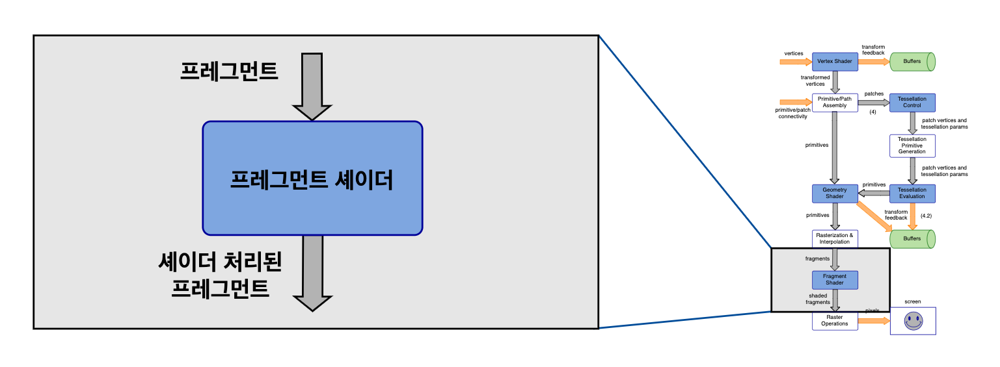

# GLSL Tutorial - 프레그먼트 셰이더

| [목차](../../README.md) | 이전: [레스터라이제이션과 보간](../07_rasterization/07_rasterization.md) | 다음: 서론 |
| :---------------------- | --------------------------------------------------------: | ---------------------------: |

<p align="center"></p>

프레그먼트 셰이더는 프레그먼트를 처리합니다. 기본적으로 프레그먼트는 이전 단계에서 보간된 모든 데이터를 더한 윈도우 상의 위치(X, Y)와 깊이값(Z)입니다.

레스터라이제이션을 통해 생성되고 보간에서 속성이 계산된 프레그먼트는 이제 프레그먼트 셰이더로 하나씩 입력됩니다. 트렌스폼 피드백이 사용되지 않는 한 이 셰이더는 선택사항이 아닙니다.

프레그먼트 셰이더는 프레그먼트 위치와 레스터라이제이션 절차에서 보간된 모든 데이터에 접근할 수 있습니다. 셰이더는 속성과 픽셀 위치에 따른 계산을 수행합니다. 픽셀의 X, Y 위치는 고정됩니다. 즉, 프레그먼트 셰이더는 다른 픽셀의 속성에 접근할 수 없습니다. 하지만, 픽셀의 깊이(Z값)은 수정할 수 있습니다.

프레그먼트 셰이더는 현재 픽셀의 위치나 다른 모든 픽셀 위치를 포함한 모든 프레임 버퍼에 접근할 수 없습니다. 버텍스 셰이더와 비슷하게 프레그먼트 셰이더는 오직 현재 픽셀과 이와 관련된 데이터에만 접근할 수 있습니다.

이전 단계들과 같이, 프레그먼트 셰이더는 어플리케이션에서 사용 가능한 모든 uniform 변수에 접근할 수 있습니다.

다음은 프레그먼트 셰이더에서 사용 가능한 몇 가지 빌트인 변수들 입니다(전체 목록은 GLSL 스펙의 빌트인 변수 색션을 참고하세요):
- `gl_FragCoord` : 프레그먼트 좌표 `(xf, yf, zf, wf)` 를 담고 있습니다. `(xf, yf)` 는 윈도우 상의 픽셀 위치이고 `zf` 는 깊이입니다. `wf`는 1/`wc` 이고 `wc`는 프레그먼트 클립 공간 위치(fragments clip space position)의 구성 요소입니다.
- `gl_FrontFacing` : 픽셀을 생성한 프리미티브의 방향을 나타냅니다. 페이스 컬링(face culling)이 활성화 되어있다면, 모든 픽셀에서 동일한 값을 가집니다.
- `gl_PrimitiveID` : 이 변수는 지오메트리 셰이더의 출력입니다. 지오메트리 셰이더가 없다면, OpenGL draw 명령어의 프리미티브 인덱스로 값이 지정됩니다.

`gl_PrimitiveID`는 OpenGL 4.1 버전에서만 사용 가능합니다.

출력 숫자 범위는 1부터 `GL_MAX_DRAW_BUFFERS` 까지입니다. 어플리케이션의 기본 설정은 `vec4` 타입의 단일 색상 출력입니다. 어플리케이션은 사용자 정의 변수를 색상 출력으로 바인딩해야 합니다. [framebuffer objects](http://www.lighthouse3d.com/tutorials/opengl_framebuffer_objects/) 를 사용하면 1개 이상의 색상 출력이 가능합니다.

다음의 셰이더는 아마도 작성할 수 있는 가장 간단한 프레그먼트 셰이더일 것입니다. 흥미로울건 없지만, 이 셰이더는 모든 것을 빨간색으로 칠합니다!

```glsl
#version 150

out vec4 colorOut;

void main()
{
    colorOut = vec4(1.0, 0.0, 0.0, 1.0);
}
```

| [목차](../../README.md) | 이전: [레스터라이제이션과 보간](../07_rasterization/07_rasterization.md) | 다음: 서론 |
| :---------------------- | --------------------------------------------------------: | ---------------------------: |

## 출처

http://www.lighthouse3d.com/tutorials/glsl-tutorial/fragment-shader/