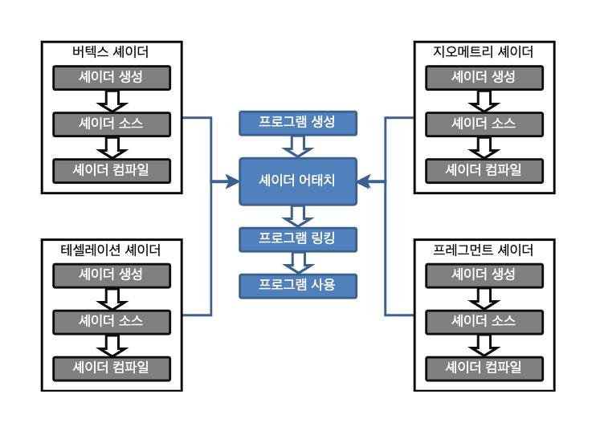

# GLSL Tutorial - OpenGL 설정

| [목차](../../README.md) | 이전: [프레그먼트 셰이더](../08_fragment_shader/08_fragment_shader.md) | 다음: 셰이더 생성 |
| :---------------------- | ---------------------------------------------------------------------: | ----------------: |

이번 색션에서는 로드, 컴파일, 링크, 실행 준비를 위한 셰이더 설정 방법을 배웁니다. 아직 여러분만의 셰이더를 작성할 준비가 되지 않았다면 GLSL 최신 버전을 다루는 자료가 적긴 하지만 인터넷에서 셰이더를 얻을 수 있는 많은 사이트가 있습니다. 나중에 튜토리얼에서 제공되는 예시 또한 시도할 수 있습니다.

시작하기 전에 최소 OpenGL 3.3 버전을 지원하는지 확인하세요. 여기서는, 다음의 기능을 사용하기 위해 [GLEW](http://glew.sourceforge.net/) 을 사용할 것입니다.

```c
#include <GL/glew.h>
#include <GL/glut.h>

void main(int argc, char **argv) {

    glutInit(&argc, argv);
    ...
    glewInit();

    if (glewIsSupported("GL_VERSION_3_3"))
        printf("Ready for OpenGL 3.3\n");
    else {
        printf("OpenGL 3.3 not supported\n");
        exit(1);
    }

    setShaders();
    initGL();

    glutMainLoop();
}
```

OpenGL에 관한 한 어플리케이션을 설정하는 것은 C 프로그램을 작성하는 워크플로와 비슷합니다. 각 셰이더는 C모듈과 같고 C에서 처럼 반드시 개별적으로 **컴파일**해야 합니다. 그리고 컴파일된 셰이더 세트는 C와 마찬가지로 프로그램에 링크됩니다.

아래의 그림은 각각의 셰이더들과 프로그램을 생성하는데 필요한 단계를 보여줍니다. 다음 세부 색션들에서 단계들을 더 자세히 알아볼 것입니다.

<p align="center"></p>

| [목차](../../README.md) | 이전: [프레그먼트 셰이더](../08_fragment_shader/08_fragment_shader.md) | 다음: 셰이더 생성 |
| :---------------------- | ---------------------------------------------------------------------: | ----------------: |

## 출처

http://www.lighthouse3d.com/tutorials/glsl-tutorial/setup/
