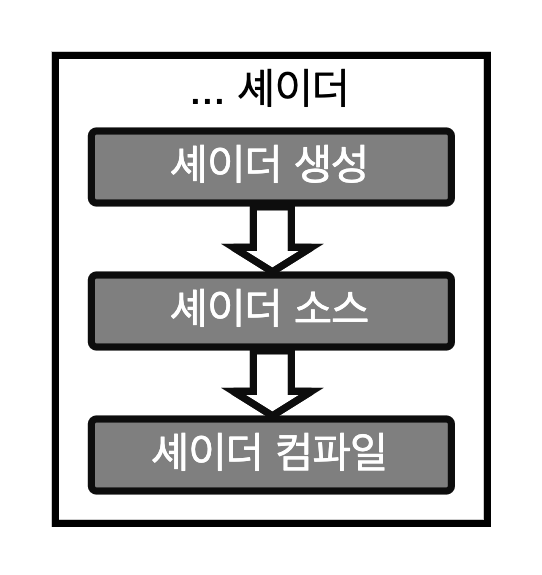

# GLSL Tutorial - 셰이더 생성

| [목차](../../README.md) | 이전: [OpenGL 설정 서론](../09_opengl_setup/09_opengl_setup.md) | 다음: 프로그램 생성 |
| :---------------------- | --------------------------------------------------------------: | ------------------: |

다음 그림은 셰이더 생성에 필요한 단계들을 나타냅니다.

<p align="center"></p>

먼저 셰이더 컨테이너로 동작할 객체를 생성합니다. 이와 같은 동작을 하는 함수는 컨테이너의 핸들을 반환합니다.

함수의 형태는 다음과 같습니다:

```cpp
GLuint glCreateShader(GLenum shaderType);

파라미터:
    - shaderType: `GL_VERTEX_SHADER`, `GL_GEOMETRY_SHADER`, `GL_TESS_CONTROL_SHADER`, `GL_TESS_EVALUATION_SHADER`, `GL_FRAGMENT_SHADER`.

반환값:
    - 셰이더 핸들
```

셰이더 프로그램은 프로그램의 함수를 가진 각각의 여러 셰이더 컨테이너로 분해될 수 있습니다. 그러나, 하나의 프로그램에는 각 셰이더 타입 세트에 대한 _main_ 함수만 있을 수 있습니다.

다음 단계는 소스 코드를 추가하는 단계입니다. 셰이더 소스 코드는 문자열 배열입니다. 단일 문자열에 대한 포인터를 사용할 수 있습니다.

셰이더 소스 코드를 설정하는 함수는 다음과 같습니다:

```cpp
void glShaderSource(GLuint shader, int numOfStrings, const char **strings, int *lengthOfStrings);

파라미터:
    - shader: 셰이더 핸들
    - numOfStrings: 배열의 문자열 개수
    - strings: 문자열 배열
    - lengthOfStrings: 각 문자열의 길이가 담긴 배열 또는 NULL. NULL의 경우는 문자열이 NULL로 종료됨을 의미합니다.
```

마지막으로, 셰이더는 컴파일되어야 합니다. 이 동작을 하는 함수는 다음과 같습니다:

```cpp
void glCompileShader(GLuint shader);

파라미터:
    - shader: 셰이더 핸들
```

셰이더 소스 코드 자체가 어플리케이션 코드 안에 문자열로 정의된다는 것을 고려하면 다음의 스니펫을 셰이더 설정에 사용할 수 있습니다:

```cpp
std::string source = "#version 330\n\
\
in vec4 Color;\n\
\
void main()\
{\
    gl_FragColor = Color;\
} ";

GLuint f;
const char * ff = source.c_str();

f = glCreateShader(GL_FRAGMENT_SHADER);
glShaderSource(f, 1, &ff, NULL);
glCompileShader(f);
```

셰이더 소스 코드가 파일 안에 있다고 가정하면, 코드는 다음과 같습니다:

```cpp
char *vs;
GLuint v;

// 셰이더 핸들러를 생성합니다.
v = glCreateShader(GL_VERTEX_SHADER);
// 파일 내부의 셰이더 소스를 읽습니다.
vs = textFileRead(vertexFileName);
// 다음 함수에 맞게 자료형을 변환합니다.
const char *vv = vs;
// GL로 소스 텍스트를 보냅니다.
glShaderSource(v, 1, &vv, NULL);
// 소스 텍스트의 메모리를 해제합니다.
free(vs);
// 마지막으로 셰이더를 컴파일합니다.
glCompileShader(v);
```

위의 코드는 텍스트를 읽는 `textFileRead` 함수를 사용합니다. 이 함수의 코드는 다음과 같습니다:

```c
#include <stdio.h>
#include <stdlib.h>
#include <string.h>

char *textFileRead(char *fn) {
    FILE *fp;
    char *content = NULL;
    int count = 0;

    if (fn != NULL) {
        fp = fopen(fn, "rt");
        if (fp != NULL) {
            fseek(fp, 0, SEEK_END);
            count = ftell(fp);
            rewind(fp);
            if (count > 0) {
                content = (char*)malloc(sizeof(char) * (count + 1));
                count = fread(content, sizeof(char), count, fp);
                content[count] = '\0';
            }
            fclose(fp);
        }
    }
    return content;
}
```

| [목차](../../README.md) | 이전: [OpenGL 설정 서론](../09_opengl_setup/09_opengl_setup.md) | 다음: 프로그램 생성 |
| :---------------------- | --------------------------------------------------------------: | ------------------: |

## 출처

http://www.lighthouse3d.com/tutorials/glsl-tutorial/creating-a-shader/
