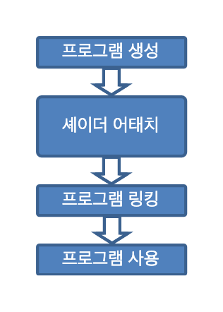

# GLSL Tutorial - 프로그램 생성

| [목차](../../README.md) | 이전: [셰이더 생성](../10_creating_a_shader/10_creating_a_shader.md) | 다음: 설정 예제 |
| :---------------------- | -------------------------------------------------------------------: | --------------: |

다음 그림은 셰이더 프로그램을 준비하고 진행하는데 필요한 단계들을 나타냅니다.

<p align="center"></p>

먼저 프로그램 컨테이너로 동작할 객체를 생성합니다. 객체를 생성하는 함수는 컨테이너의 핸들을 반환합니다.

함수는 다음과 같습니다:

```cpp
GLuint glCreateProgram(void);
```

**반환값:**

- 프로그램 핸들러

원하는대로 여러개의 프로그램을 생성할 수 있습니다. 일단 랜더링하면 한 프레임 동안에 프로그램에서 다른 프로그램으로 전환할 수 있습니다. 예를 들어 다른 셰이더를 사용하여 배경에 대한 큐브 맵을 표시하면서 굴절과 반사 셰이더를 사용하여 차주전자를 그릴수 있습니다.

다음 단계는 이전 세부 색션에서 생성된 셰이더를 위에서 생성한 프로그램에 어태치하는 것입니다. 셰이더는 이 시점에서 컴파일할 필요가 없습니다. 소스 코드가 없어도 됩니다. 프로그램에 셰이더를 어태치하는데 필요한 것은 단지 셰이더 핸들러뿐입니다.

프로그램에 셰이더를 어태치하는데 사용하는 함수는 다음과 같습니다:

```cpp
void glAttachShader(GLuint program, GLuint shader);
```

**파라미터:**

- `program`: 프로그램 핸들러
- `shader`: 셰이더 핸들러

C 프로그램이 여러개의 모듈을 가질 수 있는 것처럼, 프로그램에 여러개의 동일한 타입의 셰이더를 어태치할 수 있습니다. C와 같이, 각 셰이더 타입에서 main 함수가 있는 셰이더는 하나만 존재할 수 있습니다.

예를 들어 동일한 버텍스 셰이더를 다수의 프로그램에서 사용하고자 한다면 여러개의 프로그램에 셰이더를 어태치할 수도 있습니다.

마지막 단계는 프로그램을 링크하는 것입니다. 이 단계를 수행하기 위해서는 이전 세부 색션에서 설명한 것처럼 셰이더가 반드시 컴파일 되어야 합니다.

링크 함수는 다음과 같습니다:

```cpp
void glLinkProgram(GLuint program);
```

**파라미터:**

- `program`: 프로그램 핸들러

링크 이후에 셰이더의 코드가 수정될 수 있고 셰이더는 프로그램에 영향의 미치지 않고 재컴파일 됩니다. 수정 사항을 적용하려면 C와 같이 프로그램을 다시 링크해야 합니다.

위의 그림과 같이 프로그램을 링크한 다음에 프로그램을 실제로 로드하고 사용하는 `glUseProgram` 함수가 있습니다. 각 프로그램은 핸들러가 할당되고, 원하는 만큼 프로그램을 링크하고 사용할 준비를 할 수 있지만(하드웨어가 허용하는 경우) 하나의 프로그램만 활성화할 수 있습니다.

해당 함수는 다음과 같습니다:

```cpp
void glUseProgram(GLuint prog);
```

**파라미터:**

- `prog`: 사용하고자 하는 프로그램 핸들러 또는 0

파라미터가 0인 `glUseProgram` 함수를 호출하는 것은 가능하긴 하지만 셰이더가 정의되지 않게 되므로 바람직하지 않습니다. 다른 한 가지는 `glUseProgram` 함수로 사용하고자 하는 프로그램은 반드시 링크가 되어있어야 합니다.

지오메트리와 테셀레이션 셰이더는 선택 사항이므로 프로그램 링크가 성공하는데 필수가 아닙니다. 버텍스 셰이더는 필요합니다. 트랜스폼 피드백이 사용되지 않는 한 프레그먼트 셰이더도 필요합니다. 이 경우에는 프레그먼트 단계가 필요하지 않을 수 있습니다.

만약 프로그램이 사용되는 중에 다시 링크가 된다면, 자동적으로 다시 사용됩니다. 그래서 이런 경우에는 이 함수를 다시 호출할 필요가 없습니다.

다음 코드는 `s1` 과 `s2` 가 이전 색션의 설명대로 생성된 셰이더 핸들러라고 가정했을 때의 필요한 모든 동작을 실행합니다:

```cpp
GLuint p;

p = glCreateProgram();

glAttachShader(p, s1);
glAttachShader(p, s2);

glLinkProgram(p);
...
// and later on
glUseProgram(p);
```

| [목차](../../README.md) | 이전: [셰이더 생성](../10_creating_a_shader/10_creating_a_shader.md) | 다음: 설정 예제 |
| :---------------------- | -------------------------------------------------------------------: | --------------: |

## 출처

http://www.lighthouse3d.com/tutorials/glsl-tutorial/create-a-program/
