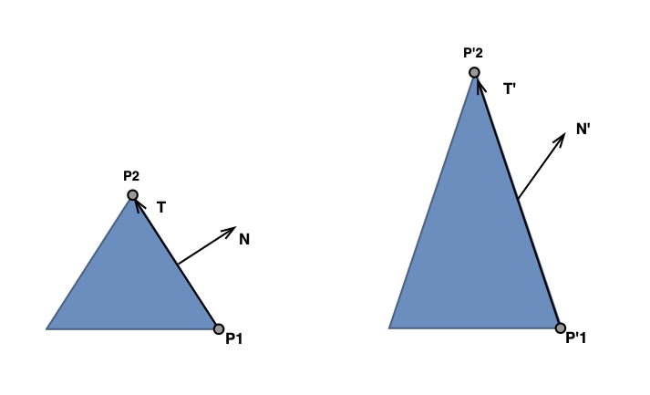

# GLSL Tutorial - 공간과 행렬

| [목차](../../README.md) | 이전: 셰이더 간 통신 | 다음: [보간 문제](../24_interpolation_issues/24_interpolation_issues.md) |
| :---------------------- | -------------------: | --------------: |

셰이더를 보여주기 전에, 공간과 행렬에 대해서 조금 이야기를 할 것입니다. 우리는 주로 파이프라인 내부의 많은 공간에서 작업하기 때문에 이것들은 기본이 되는 개념들입니다. 그리고 셰이더에서 실제로 어떤 동작이 일어나고 있는지 이해하기 위해 공통점을 찾는 것은 중요합니다.

컴퓨터 그래픽스에서 우리의 목적에 맞는 4개의 관련된 공간은 다음과 같습니다:

- 로컬 공간 : 모델이 생성되는 공간
- 월드 공간 : 3D 씬을 조립하는 공간
- 카메라 공간 : 카메라가 원점에 위치하고 Z축의 음의 방향을 바라보는 공간
- 클립 공간 : 뷰 프러스텀이 원점이 중앙에 위치하고 모든 축이 -1 ~ 1 범위에 있는 정육면체로 변형된 포스트 프로젝션 공간

이 4개의 공간 사이의 변환을 위해서는 3개의 4x4 행렬이 필요합니다:

- 모델 행렬 : 로컬 공간을 월드 공간으로 변환
- 뷰 행렬 : 월드 공간을 카메라 공간으로 변환
- 프로젝션 행렬 : 카메라 공간을 클립 공간으로 변환

다음과 같이 행렬을 합성하면 연산을 편리하게 처리할 수 있습니다:

- $viewModel = view \times model$
- $projViewModel = projection \times view \times model$

위의 행렬을 사용하면 공간 사이의 변환을 더 빠르게 하고 다이어그램에서 인접하지 않은 공간으로의 변환에 필요한 덧셈, 곱셈 연산량을 줄일 수 있습니다.

_model_ 행렬과 _view_ 행렬은 일반적으로 이동(translation), 회전(rotations), 크기조절(scales)을 바탕으로 생성됩니다. 이 기하학적 변환은 아핀 변환(affine transformations)을 나타냅니다. 즉, 직선과 비율을 유지하는 변환 - 직선 상에 세 점이 존재한다면, 변환 후에도 직선 상에 존재하고 직선의 변환된 중점은 여전히 변환된 직선의 중점이 됩니다. 또한 각도나 길이가 반드시 유지되는 것은 아니지만 두 평행한 직선은 변환 후에도 평행을 유지합니다.

동차 좌표계를 사용하는 일반적인 아핀 변환의 행렬은 마지막 행이 [0 0 0 1]입니다. 마지막 열은 이동에 대한 변환을 담고 있고, 위쪽 3x3 부분 행렬은 회전과 크기조절에 대한 변환을 나타냅니다.

여기서는 처음 세 공간(로컬, 월드, 카메라) 사이의 변환을 고려할 때, 아핀 변환에 대해서만 고려할 것입니다.

프로젝션 행렬은 일반적으로 원근 투영(perspective projection)을 나타냅니다. 원근 투영은 투영 후에 평행선이 평행을 유지하지 않기 때문에 동일한 변환 클래스에 속하지 않습니다. 따라서 원근 투영은 아핀 변환이 아닙니다.

### 로컬 공간, 월드 공간, 카메라 공간 사이의 변환

점 (x, y, z, 1.0)의 공간 변환을 하기 위해서 위의 행렬을 사용합니다. 예를 들어, 점 $P$ 을 로컬 공간에서 카메라 공간으로 변환하기 위해서는 다음과 같이 작성합니다:

$$P' = view \times model \times P = viewModel \times P$$

오직 아핀 변환만을 고려하기 때문에 변환된 점은 (x', y', z', 1.0)의 일반적인 형태입니다.

벡터 $(x,\ y,\ z,\ 0.0)$ 는 동일한 절차로 변환됩니다. 그리고 변환된 벡터는 $(x',\ y',\ z',\ 0.0)$ 의 형태입니다. 특히, 벡터의 네 번째 원소는 0이기 때문에, 벡터의 처음 원소 3개와 위쪽 3x3 부분 행렬을 사용하여 동일한 결과를 얻을 수 있습니다.

위의 내용은 두 점의 차이로 표현될 수 있는 모든 벡터에 적용할 수 있습니다. 이러한 벡터를 고려한 벡터 변환은 각 점을 변환하고 변환된 점 간의 차이를 계산한 것과 동일합니다.

$$v = P_2 - P_1$$
$$v' = M \times v = M \times (P_2 - P_1) = M \times P_2 - M \times P_1 = P_2' - P_1'$$

법선 벡터는 이러한 방법으로 표현할 수 없는 특이한 벡터입니다. 법선 벡터의 크기는 상수값 1.0입니다. 그리고 방향이 두 점의 차이로 정의되지 않고 표면에 수직인 방향으로 정의되는 벡터입니다.

따라서, 법선 벡터를 변환하기 위해서는 변환된 표면에 수직인 성질을 유지하면서 벡터를 변환하는 행렬을 사용해야 합니다. 그러면 이와 같은 행렬 계산은 어떻게 할까요?

아래 그림의 벡터들에 대해 생각해봅니다.

왼쪽에 원본 삼각형과 모서리에 대한 법선 벡터가 있습니다. 오른쪽에는 모든 점과 벡터가 (1, 2, 1) 스케일로 변환된 삼각형과 법선 벡터가 있습니다.

벡터 T는 삼각형 모서리에 접하고 있고 다음과 같이 정의합니다

$$T = P_2 - P_1$$

위에서 보았다시피, T의 변환은 변환된 점들의 차이와 동일합니다. 즉,

$$T' = P_2' - P_1'$$

그러므로, 변환된 벡터 T'는 여전히 모서리에 접하고 있습니다. 반면에 변환된 법선 벡터 N'은 더이상 모서리에 수직이 아닙니다.

이전에 설명했던 대로, 벡터를 변환할 때 벡터의 처음 세 요소와 위쪽 3x3 부분 행렬만 고려할 수 있습니다. 법선 벡터 N을 변환하기 위해 변환 후에도 N'이 T에 대해 수직임을 보장하는 새로운 행렬이 필요합니다. 이 N을 변환하는 3x3 행렬을 G, 그리고 T를 변환하는 3x3 행렬을 M이라고 가정합니다.

변환 후에 두 벡터가 반드시 수직을 유지해야 하므로, 두 벡터의 내적은 반드시 0입니다.

$$(MT) \cdot (GN) = 0$$

내적을 행렬 곱셈으로 다시 쓰면

> 💡 유클리드 공간의 벡터는 종종 열벡터로 간주되며, 이 경우 두 벡터 a, b의 스칼라곱은 다음과 같이 나타낼 수 있다. 출처: [위키백과](https://ko.wikipedia.org/wiki/%EC%8A%A4%EC%B9%BC%EB%9D%BC%EA%B3%B1#%EB%8C%80%EC%88%98%EC%A0%81_%EC%A0%95%EC%9D%98) 
> $$a \cdot b = a^Tb$$

$$(MT)^T(GN) = T^TM^TGN$$

만약

$$M^TG = I$$

라면

$$T^TM^TGN = T^TN = T \cdot N = 0$$

따라서 행렬 G와 행렬 M의 관계는 다음과 같습니다:

$$M^TG = I$$

그러므로, 행렬 M의 전치행렬의 역행렬을 양변에 곱하면 다음 식을 얻을 수 있습니다.

$$(M^T)^{-1}M^TG = (M^T)^{-1}$$
$$G= (M^T)^{-1}$$

그러므로, 법선 행렬 G는 행렬 M의 전치행렬의 역행렬입니다. 즉, 4x4 행렬의 위쪽 3x3 부분 행렬의 전치 행렬의 역행렬이 점을 변환하는데 사용됩니다.

다음의 경우 행렬이 직교한다고 합니다. 참고 : [위키백과](https://ko.wikipedia.org/wiki/%EC%A7%81%EA%B5%90%ED%96%89%EB%A0%AC)

$$AA^T = I$$

또는

$$A^T = A^{-1}$$

만약 행렬 M이 직교 행렬이라면

$$G = M$$

이므로 어떤 경우에는 단순화할 수 있습니다.

직교 행렬(orthogonal matrix)는 모든 행(열)이 단위 길이이고 서로 수직입니다. 단위 행렬과 같은 직교 행렬에서 시작하여 회전(rotations), 이동(translations)을 위한 기하학적 변환은 이러한 성질을 유지합니다. 행렬의 행(열)벡터의 크기를 변경하는 크기 조절(scales)에는 적용되지 않습니다.

그러므로, 회전과 이동만 사용하면 행렬이 항상 직교하고 법선 벡터를 포함한 모든 벡터를 동일한 행렬로 변환할 수 있습니다.

이 튜토리얼에서 제공할 셰이더가 크기 조절을 처리할 수 있도록 하기 위해 법선 행렬(3x3)을 사용하여 법선 벡터(3x1)을 변환하고 일반 행렬(4x4)을 사용하여 다른 모든 벡터(4x1)와 점을 변환합니다.

| [목차](../../README.md) | 이전: 셰이더 간 통신 | 다음: [보간 문제](../24_interpolation_issues/24_interpolation_issues.md) |
| :---------------------- | -------------------: | --------------: |

## 출처

http://www.lighthouse3d.com/tutorials/glsl-tutorial/spaces-and-matrices/
