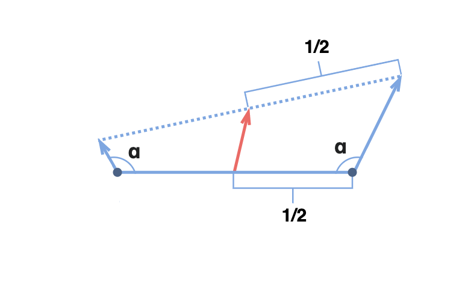
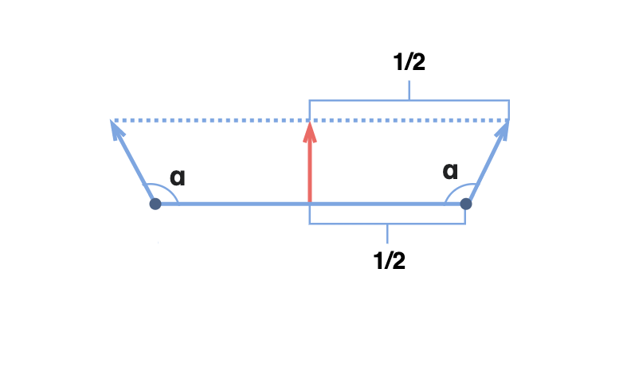

# GLSL Tutorial - 보간 문제

| [목차](../../README.md) | 이전: [공간과 행렬](../23_spaces_and_matrices/23_spaces_and_matrices.md) | 다음: OpenGL 스켈레톤 |
| :---------------------- | -------------------: | --------------: |

[이전 섹션](../07_rasterization/07_rasterization.md) 에서 다뤘듯이, 버텍스 당 계산된 데이터는 프레그먼트 데이터를 얻기위해 보간됩니다.

보간(interpolation) 절차는 거의 모든 상황에서 완벽하게 동작합니다. 그러나, 보간이 문제를 일으키는 경우가 존재합니다: 바로 법선 벡터의 보간입니다.

컴퓨터 그래픽스에서 법선은 단위 길이여야 합니다. 일반적으로 어플리케이션에 모델을 임포트할 때 그렇습니다. 하지만 필요조건은 아닙니다. 그래서 버텍스의 법선 속성이 버텍스 셰이더에 도착했을 때 단위 길이가 보장되지 않습니다. 게다가, 버텍스 셰이더에서 법선 벡터가 변환될 때, 벡터의 크기가 변경될 수 있습니다. 벡터 n이 단위 길이일지라도, 다음의 변환 후 벡터 n'

$$n' = normalMatrix \times n$$

이 단위 길이임을 보장할 수 없습니다. 이 벡터들을 보간할 경우에 문제가 발생할 수 있습니다. 보간된 벡터를 나타내는 다음 그림에 대해 생각해보세요.

이 그림에서, 가운데의 보간된 벡터는 수직 방향을 가져야 합니다. 보다시피, 가장 큰 벡터가 보간된 벡터의 방향에 더 많은 영향을 주고 있습니다. 일반적으로 이 문제를 해결하기 위해 버텍스 셰이더에서 변환한 후에 법선 벡터를 정규화할 수 있습니다.

그러나 변환된 벡터가 변환 전의 길이를 유지하도록 보장되는 상황이 존재합니다. 모델 행렬과 뷰 행렬에서 이동, 회전만 사용한 경우, 또는 더 자세히 말해서 직교 행렬인 경우에([이전 섹션](../23_spaces_and_matrices/23_spaces_and_matrices.md) 참고) 법선 벡터의 길이가 유지됩니다.

결론적으로, 법선 행렬이 직교 행렬이고 어플리케이션에서 정규화된 벡터를 버텍스 셰이더로 전달하도록 한다면 버텍스 셰이더에서 법선 벡터의 정규화를 하지 않을 수 있습니다. 하지만, 안전한 작업을 위해서 버텍스 셰이더에서 법선 벡터를 변환한 후에 정규화하세요.

벡터가 프레그먼트 셰이더에 전달되면 다시 정규화를 해야합니다! 왜일까요? 정규화된 법선 벡터의 보간은 올바른 방향을 보장하지만 일반적으로 크기는 올바르지 않기 때문입니다! 다음 그림을 보세요:

보다시피, 양끝의 두 벡터가 단위 길이라면 가운데 벡터는 더 작은 크기를 가집니다. 이 문제를 해결하기 위해 프레그먼트 셰이더에 전달되는 벡터를 정규화해야 합니다.

정규화를 하지 않을 수 있을까요? 가능합니다. 하지만 모든 버텍스가 같은 법선을 가지는 경우에만 보간된 법선이 동일합니다.

안전한 작업을 위해 두 셰이더에서 항상 법선 벡터를 정규화하세요. 변환 후의 버텍스 셰이더에서, 그리고 모든 작업을 하기 전의 프레그먼트 셰이더에서. 정규화하지 않은 최종 효과는 명확하지 않을 수 있음을 인지하세요. 그러므로 정규화를 하지않으므로 성능을 향상시키려면 각별히 주의해야 합니다.

두 점 사이의 차로 계산할 수 있는 다른 모든 벡터는 올바르게 보간됩니다([이전 섹션](../23_spaces_and_matrices/23_spaces_and_matrices.md) 참고). 그러므로 버텍스 셰이더에서 정규화가 필요하지 않습니다.

| [목차](../../README.md) | 이전: [공간과 행렬](../23_spaces_and_matrices/23_spaces_and_matrices.md) | 다음: OpenGL 스켈레톤 |
| :---------------------- | -------------------: | --------------: |

## 출처

http://www.lighthouse3d.com/tutorials/glsl-tutorial/interpolation-issues/
