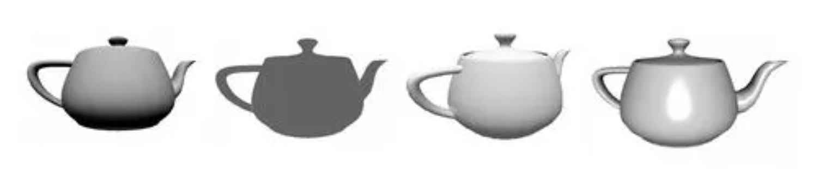
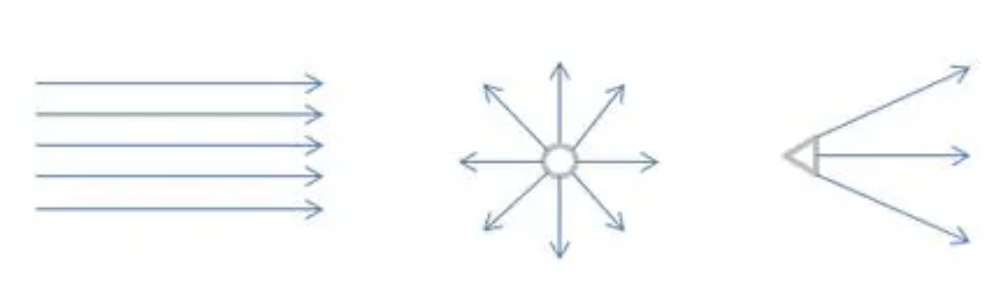

# GLSL Tutorial - 라이팅

| [목차](../../README.md) | 이전: 색이 입혀진 정육면체색이 입혀진 정육면체 | 다음: [버텍스별 디렉셔널 라이트 1](./../29_directional_lights_per_vertex_1/29_directional_lights_per_vertex_1.md) |
| :---------------------- | -------------------: | --------------: |

컴퓨터 그래픽스에서 라이팅은 필수적인 요소입니다. 라이팅이 없는 씬은 입체감이 없어보이기 때문에 오브젝트의 모양을 인식하기 어렵습니다. 이번 섹션에서 기본적인 라이팅과 셰이딩 모델에 대해 알아보겠습니다.

라이팅 모델은 특정 위치에서 빛이 어떻게 반사되는지 결정합니다. 특정 위치에서 인식된 색상은 매개변수의 수에 의존합니다. 예를 들어, 빛의 방향, 카메라의 방향, 머티리얼의 속성 등이 있습니다.

셰이딩 모델은 라이팅 모델이 어떤 방식으로 표면을 밝히는지와 연관되어 있습니다.
예를 들어, 
- 플랫 셰이딩(**Flat** shading): 삼각형 당 하나의 색상 값을 계산
- 고러드 셰이딩(**Gouraud** shading): 삼각형의 버텍스 당 하나의 색상 값을 계산하고 삼각형 내부의 픽셀 당 색상 값을 보간
- 퐁 셰이딩(**Phong** shading): 표면의 모든 픽셀 당 색상 값을 계산

라이팅은 색상과 매우 관련되어 있습니다. 오브젝트가 빛을 받으면 색상을 관찰할 수 있습니다. 그러나 오브젝트에 빛이 도달하지 않는다면 오브젝트는 완전한 검은색으로 보입니다.

컴퓨터 그래픽스의 색상은 다음의 용어로 구성됩니다:

- diffuse: 오브젝트의 표면에서 모든 방향으로 반사되는 빛입니다 오브젝트의 일반적인 색상을 나타냅니다.
- ambient: 주변 반사를 표현하는데 사용됩니다. 빛이 직접적으로 도달하지 않는 지점에 대한 빛입니다. 그렇기 때문에 빛이 직접적으로 도달하지 않는 지점이 너무 어두어지지 않게 합니다. 일반적으로 이 값은 diffuse 값에 비례합니다.
- specular: 카메라 시점이 정반사광의 진행 방향에 있을 경우 강하게 반사되는 빛입니다. diffuse 값과 관련이 없습니다.
- emissive: 오브젝트가 빛을 발산하는 값입니다.

아래의 그림은 오브젝트가 빛을 받았을 때 세 가지 색상 요소의 효과를 보여줍니다. 오브젝트의 머티리얼을 정의하기 위해서 위의 각 요소에 대한 값을 정의합니다.

Figure: diffuse; ambient; diffuse + ambient; diffuse + ambient + specular (왼쪽에서 오른쪽으로)

빛의 종류 또한 다양합니다. 가장 일반적이고 구현하기 쉬운 빛의 유형은 **directional, point, spotlights** 입니다.

**directional light** 는 광원이 무한히 멀리 떨어져 있고 거리에 따른 감쇠가 없는 것처럼 모든 광선이 평행하다고 가정합니다. 예를 들어, 태양에서 지구의 관찰자로 도달하는 빛은 모든 실용적인 목적에서 directional light입니다. 모든 버텍스와 프레그먼트에 대해 빛의 방향은 일정하므로 구현하기 가장 쉬운 유형의 빛입니다.

**Point light** 은 일반적인 램프 또는 태양계에서의 태양처럼 모든 방향으로 광선이 퍼집니다. 

**Spotlights** 특정 방향으로만 빛을 발산하는 point light입니다. 일반적인 접근 방식은 light volume이 원뿔이고 빛의 위치가 원뿔의 꼭대기라고 생각하는 것입니다. 따라서 오브젝트는 원뿔의 안쪽에 있는 경우에만 빛을 받습니다.

Figure: direction light, point light, spotlight (왼쪽에서 오른쪽으로)

카메라 또는 눈의 위치에서 오브젝트에 반사되는 빛을 계산하는 다양한 접근 방식이 있습니다. 특정 위치에 대한 빛의 반사를 계산하려면 빛이 어디서 오는지, 빛의 방향 벡터와 표면 법선 벡터(표면에 수직인 벡터) 사이의 각, 카메라의 위치 등이 필요합니다. 특정 위치에 대한 색상 또는 반사광을 계산하는 방정식은 어떤 설정이 어떻게 사용될지 나타냅니다.

위에서 언급한대로 옵션은 라이팅 방정식에 국한되지 않습니다. 삼각형을 고려하면 각 버텍스에서 라이팅을 계산하고 삼각형 내부의 각 프레그먼트에서 보간할 수 있습니다. 또는 사용가능한 모든 버텍스 데이터를 보간하여 프레그먼트 셰이더로 보낸 다음 프레그먼트별 색상을 계산할 수 있습니다. 이러한 셰이딩 모델들은 라이팅 방정식과 독립적입니다. 어떤 방정식이든 위의 셰이딩 모델과 결합하여 씬을 빛출 수 있다는걸 말합니다.

셰이더를 작성할 수 없던 과거의 고정함수 파이프라인 OpenGL 버전(OpenGL 2.0 이전버전)에서는 버텍스별로 라이팅을 계산했습니다. 그다음 각 버텍스 색상은 레스터라이제이션과 보간 단계로 보내집니다. 이 단계는 계산된 각 프레그먼트에 대해 색상이 보간됩니다. 고정함수 파이프라인에는 고러드 셰이딩 모델이 구현되어 있습니다. 렌더링 결과는 훌륭하지 않았습니다. 보간은 폴리곤 안쪽에서 다양한 방식으로 변할 수 있는 라이팅을 계산하는데 가장 좋은 방법이 아니였기 때문입니다. spotlight이 삼각형의 중심만 비추고 삼각형의 버텍스들은 비추지 않는 상황이라고 가정해봅시다. 렌더링 결과는 빛을 받지 않는 삼각형이 될 것입니다. 그러나 이건 완전히 잘못된 계산입니다.

고러드 셰이딩은 일반적으로 버텍스보다 픽셀이 훨씬 많고 계산 성능이 훨씬 낮을 때 의미가 있습니다. 오늘날의 컴퓨터는 성능이 향상되어 씬에서 더 많은 버텍스를 사용할 수 있게 되었습니다. 이러한 상황들과 버텍스별 라이팅의 좋지 않은 결과로 현재는 픽셀별 라이팅(즉, 퐁 셰이딩 모델)을 사용하는 것이 일반적인 추세입니다.

위의 모든 내용은 빛을 받는 지점, 광원, 카메라 위치에 집중되어 있습니다. 하지만 그림자는 어떤가요? 이것은 빛을 받는 지점에서 각 광원까지 경로에 다른 물체가 있는지 테스트하는 것을 의미합니다.  And why can’t other objects act as light sources themselves, reflecting the light that hits them towards our point, thereby contributing to its final colour? 회절은? 라이팅은 매우 복잡한 문제이며, 몇몇은 라이팅이 컴퓨터 그래픽스의 주요 문제라고 말할 수도 있을 것입니다.

어쨌든 어딘가에서 시작해야 합니다. 그러므로 나머지 지오메트리와의 상호 작용을 고려하지 않고 카메라와 광원만 고려하여 라이팅한다는 간단한 가정을 하고 시작하겠습니다. 다음 섹션에서는 위에서 언급한 버텍스별과 프레그먼트별 라이팅을 시뮬레이션하는 셰이더를 작성합니다. 

| [목차](../../README.md) | 이전: 색이 입혀진 정육면체색이 입혀진 정육면체 | 다음: [버텍스별 디렉셔널 라이트 1](./../29_directional_lights_per_vertex_1/29_directional_lights_per_vertex_1.md) |
| :---------------------- | -------------------: | --------------: |

## 출처

http://www.lighthouse3d.com/tutorials/glsl-tutorial/lighting/