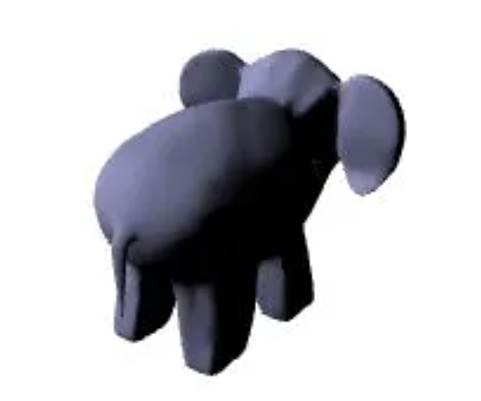

# GLSL Tutorial - 버텍스별 디렉셔널 라이트 1

| [목차](../../README.md) | 이전: [라이팅](./../28_lighting/28_lighting.md) | 다음: [버텍스별 디렉셔널 라이트 2](./../30_directional_lights_per_vertex_2/30_directional_lights_per_vertex_2.md) |
| :---------------------- | -------------------: | --------------: |

반사광의 세기를 계산하기 위해, 렘버시안 분산 반사 모델(Lambertian diffuse reflection model)을 가정하여 빛으로 향하는 벡터(L)와 법선 벡터(N)사이의 코사인을 계산합니다. 코사인은 두 벡터의 내적(dot product)으로 계산할 수 있습니다:

<p align="center"></p>

$$cos(\alpha) = \frac {L \cdot N}{|L| \times |N|}$$

그러므로 벡터 $L$ 과 벡터 $N$ 이 정규화되었다고 가정하면 이 두 벡터 사이의 내적으로 코사인을 계산할 수 있습니다. 그 다음 내적값에 오브젝트 머티리얼의 diffuse 계수 $K_d$ 를 곱합니다. 라이팅 방정식은 다음과 같습니다:

$$I = K_d \times cos(\alpha) = K_d \times (N \cdot L)$$

여러 벡터끼리의 계산은 반드시 동일한 공간에서 수행해야 합니다. 일반적으로 작업할 수 있는 공간은 여러 개입니다. 로컬 공간, 월드 공간, 카메라 공간은 벡터 연산을 하는 가장 일반적인 공간입니다. 라이팅과 관련하여, 이러한 공간에서 빛의 방향과 기타 속성들을 정의할 수 있습니다. 빛을 로컬 또는 모델 공간에서 정의하는 경우, 픽사의 룩소 주니어(Luxo Jr.)와 같은 책상 램프의 전구처럼 빛이 오브젝트에 붙어있는 것처럼 동작합니다. 빛을 월드 공간에서 정의하는 경우, 카메라나 오브젝트에 관련없이 3D 세계에 배치되는 것처럼 동작합니다. 빛을 카메라 공간에서 정의하는 경우, 빛은 카메라를 기준으로 정의됩니다(카메라 공간에서 카메라는 원점에 위치하고 Z축의 음수 방향을 바라봅니다). 카메라가 이동하면 빛은 항상 카메라를 따라갑니다. 광부 헬멧의 램프가 이런 빛의 예입니다. 광부의 눈을 카메라라고 생각해보세요.

여러 공간에서 여러 개의 빛으로 작업하는 셰이더의 경우, 모든 빛이 동일한 공간에서 정의된다고 가정하면 셰이더 프로그래머의 인생은 더 편해질 수 있습니다. 카메라 공간은 일반적인 옵션입니다. 이것은 빛의 속성이 정의된 공간에서 카메라 공간으로의 사전 변환을 의미합니다.

따라서 방향, 위치와 같은 빛의 속성을 어플리케이션에서 변환하고 카메라 공간의 이 값을 셰이더로 보냅니다. 또는 빛이 정의되는 위치를 고려하고 셰이더에서 이러한 속성들을 적절하게 변환해야 합니다.

빛이 월드 공간에 정의된 경우, 셰이더에 있는 그대로 보내는 것은 셰이더 내부에서 이 값을 카메라 공간으로 변환해야함을 의미합니다. 즉, 빛의 방향을 나타내는 벡터(벡터는 빛을 가리킵니다.)는 뷰 행렬에 의해 변환되어야 합니다. 또 다른 옵션은 어플리케이션에서 카메라 공간의 값을 미리 제공한다고 가정하는 것입니다. 빛이 월드 공간에 정의되는 경우, 일반적으로 빛의 속성은 한 프레임 동안 또는 어플리케이션의 전체 실행 동안 변하지 않습니다. 두 번째 접근 방식은 어플리케이션 측에서 프레임당 최대 한 번의 계산을 의미합니다. 매우 많은 수의 각 버텍스에 대해 동일한 변환을 수행합니다. 여기서는 어플리케이션에서 변환된 빛의 속성을 셰이더로 제공하는 두 번째 접근 방식을 사용할 것입니다. 위에서 언급한 것처럼, 코사인 계산을 단순화하기 위해 벡터는 정규화 되어야 합니다. 따라서 빛 벡터의 정규화도 어플리케이션에서 처리합니다.

[VSMathLib](http://www.lighthouse3d.com/very-simple-libs/vsml/)과 [VSShaderLib](http://www.lighthouse3d.com/very-simple-libs/vsshader-lib-very-simple-shader-library/)을 사용하면 매우 간단합니다. 빛의 방향이 `Lights` 블록 안의 `l_dir` 변수에 저장된다고 가정하고, 렌더링 함수 시작 부분에 다음 스니펫이 필요합니다.

```cpp
// load the identity matrix
vsml->loadIdentity(VSMathLib::VIEW);
// set camera
vsml->lookAt(camX, camY, camZ, 0,0,0, 0,1,0);

float lightDir[4] = {1.0f, 1.0f, 1.0f, 0.0f}; // light dir in world space
float res[4]; // here we'll store the light's direction in camera space
// transform light to camera space, normalize it, and send to GLSL
vsml->multiMatrixPoint(VSMathLib::VIEW, lightDir, res);
vsml->normalize(res);
shader.setBlockUniform("Lights", "l_dir", res);
```

카메라 공간에서 작업을 한다고 가정하면, 법선 벡터는 반드시 로컬 공간에서 카메라 공간으로 변환되어야 합니다. 이 목적에 맞게 법선 벡터를 사용할 것입니다.

모든 셰이더에서 `m_pvm` (`mat4`) 행렬은 프로젝션, 뷰, 모델 행렬을 곱한 행렬입니다. `m_normal` (`mat3`)은 법선 행렬입니다.

버텍스 셰이더는 각 버텍스의 위치와 법선 벡터를 입력으로 받고, 계산된 색상을 출력으로 보내야 합니다. 또한 위에 언급된 행렬들과 빛의 방향 벡터인 lightDir (vec4) 과 머티리얼의 diffuse 색상인 diffuse (vec4) 가 필요합니다.

이 첫 번째 예에서는 과하게 보일 수도 있지만, 행렬, 머티리얼, 빛 속성에 대한 [uniform 블록](http://www.lighthouse3d.com/tutorials/glsl-tutorial/uniform-blocks/) 을 사용할 것입니다. 이러면 코드를 깔끔하게 유지할 수 있습니다.

[셰이더 간 통신](http://www.lighthouse3d.com/tutorials/glsl-tutorial/inter-shader-communication/) 하기 위해 blocks 을 사용할 것입니다.

버텍스 셰이더는 다음과 같이 작성합니다:

```glsl
#version 330

layout (std140) uniform Matrices {
    mat4 m_pvm;
    mat3 m_normal;
};

layout (std140) uniform Materials {
    vec4 diffuse;
};

layout (std140) uniform Lights {
    vec3 l_dir;     // camera space
};

in vec4 position;   // local space
in vec3 normal;     // local space

// the data to be sent to the fragment shader
out Data {
    vec4 color;
} DataOut;

void main() {
    // transform normal to camera space and normalize it
    vec3 n = normalize(m_normal * normal);

    // compute the intensity as the dot product
    // the max prevents negative intensity values
    float intensity = max(dot(n, l_dir), 0.0);

    // compute the color per vertex
    DataOut.color = intensity * diffuse;

    // transform the vertex coordinates
    gl_Position = m_pvm * position;
}
```

출력 색상은 프레그먼트별 `gl_Position` 값을 기반으로 보간되고 프레그먼트별 결과값은 프레그먼트 셰이더에 입력됩니다. 프레그먼트 셰이더는 입력받은 색상을 단지 출력만 합니다.

```glsl
#version 330

in Data {
    vec4 color;
} DataIn;

out vec4 outputF;

void main() {
    outputF = DataIn.color;
}
```

위의 셰이더를 실행하면 아래의 그림을 볼 수 있습니다:

<p align="center"></p>

빛을 받는 표면은 멋진 곡선을 가지고 있지만 빛을 받지않는 표면은 완전히 어둡습니다. 이 현상을 해결하는 간단한 방법은 ambient light을 살짝 추가하는 것입니다. 결과 색상에 ambient 항을 추가하여 간단히 구현합니다.

$$I = K_d \times (N \cdot L) + K_a$$

일반적으로 ambient 항은 diffuse 항의 축소된 값입니다. 아래 그림에서 ambient 항은 diffuse 항의 1/4 값입니다. 이것이 모든 머티리얼에 대해 해당된다면, 색상을 계산하는 또 다른 옵션은 다음과 같습니다:

$$I = K_d \times (N \cdot L) + K_d \times 0.25 = K_d \times ((N \times L) + 0.25)$$

머티리얼의 ambient 설정에 따라, 빛을 받는 모델의 영역에 ambient 색상도 추가되므로 매우 밝은 사진을 만들 수 있습니다. 또 다른 옵션은 두 요소 사이의 최대값을 계산하는 것입니다. 이 접근 방식에서, ambient 항은 모델의 빛을 받지 않는 영역에서 최소한의 빛을 의미하는 임계값으로 볼 수 있습니다.

$$I = max(K_d \times (N \cdot L),\ K_a)$$

다음 그림은 위 세 가지 방법의 결과입니다:

<p align="center"></p>

Figure: 왼쪽 그림: diffuse 만; 가운데 그림: diffuse + ambient; 오른쪽 그림: max(diffuse, ambient)

최대값을 사용하는 방법으로 셰이더를 작성하겠습니다. 버텍스 셰이더는 매우 비슷합니다. 바뀐 부분을 아래에 표시했습니다:

```glsl
layout (std140) uniform Materials {
    vec4 diffuse;
    vec4 ambient;   // 추가
}

...

void main() {

    ...
    
    // compute the color as the maxium between the two components
    DataOut.color = max(intensity * diffuse, ambient);  // 추가

    ...
}
```

프레그먼트 셰이더는 동일합니다.

다음 섹션에서는 머티리얼의 specualr 항에 대해 알아보겠습니다.

| [목차](../../README.md) | 이전: [라이팅](./../28_lighting/28_lighting.md) | 다음: [버텍스별 디렉셔널 라이트 2](./../30_directional_lights_per_vertex_2/30_directional_lights_per_vertex_2.md) |
| :---------------------- | -------------------: | --------------: |

## 출처

http://www.lighthouse3d.com/tutorials/glsl-tutorial/directional-lights/