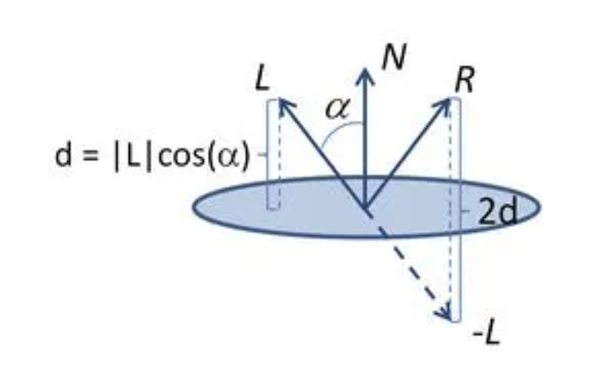
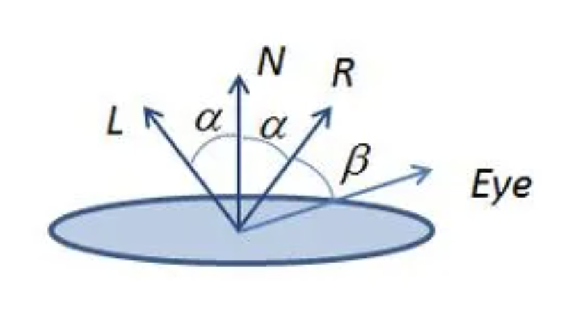
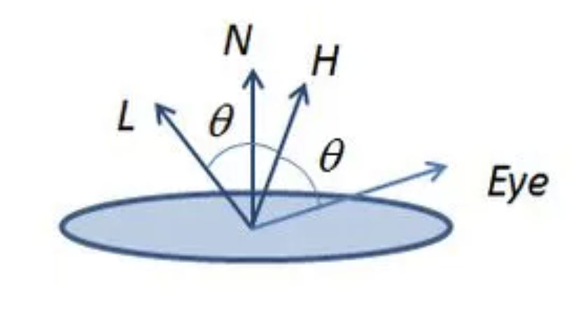
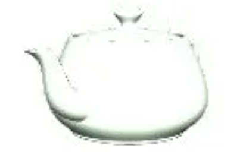
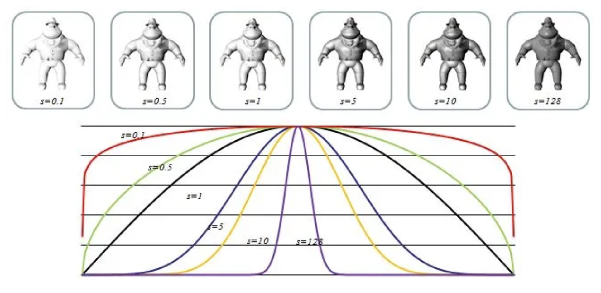
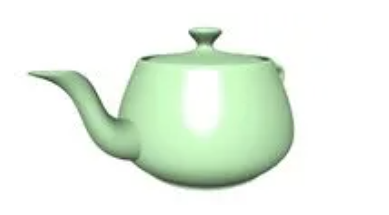
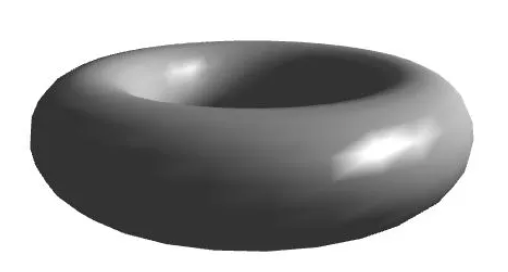

# GLSL Tutorial - 버텍스별 디렉셔널 라이트 2

| [목차](../../README.md) | 이전: [버텍스별 디렉셔널 라이트 1](./../29_directional_lights_per_vertex_1/29_directional_lights_per_vertex_1.md) | 다음: 픽셀별 디렉셔널 라이트|
| :---------------------- | -------------------: | --------------: |

광택이 있는 머티리얼을 다룰 때, diffuse 색상과 다른 색상의 밝은 점을 카메라와 빛의 방향에 따라 관찰할 수 있습니다. 예를 들어 사과는 초록색이지만 빛의 색상의 밝은 점이 있습니다. 이 밝은 점은 specular highlight라고도 합니다. specular highlight는 크기가 다양하고 금속성 물체에서는 더 선명하고 플라스틱에서는 더 흐릿합니다. specular highlight의 위치와 세기는 관찰자의 위치에 따라 다양합니다.

대부분의 머티리얼에서, 반사된 specular light의 세기는 벡터 $N$ 과 벡터 $L$ 사이의 각이 작을 때 최대가 됩니다. 반사 벡터는 다음 그림처럼 계산될 수 있습니다:

<p align="center"></p>

Figure: 반사 벡터 계산

벡터 $L$ 와 벡터 $N$ 둘 다 정규화되어 있고 $cos(\alpha)$ 는 벡터 $L$ 와 벡터 $N$ 사이의 내적임을 알고 있습니다. 벡터 $-L$ 의 끝에서 에서 벡터 $R$ 의 끝으로 가려면 벡터 $N$ 방향으로 $cos(\alpha)$ 의 두 배 크기만큼 가야 합니다. 위 그림에 따라 $R$ 을 계산하는 방정식은 다음과 같습니다:

$$R = -L + 2(N \cdot L) \times N$$

specular highlight의 세기는 카메라 벡터와 반사 벡터가 같은 방향일 때 최대가 됩니다. 카메라 벡터가 반사된 빛 벡터에서 멀어지면 specular highlight의 세기는 감소합니다.

퐁(Phong)은 specular highlight의 세기가 반사 벡터와 eye 벡터 사잇각의 코사인으로 계산될 수 있다고 제안했습니다. 다음 그림에 표시되어 있습니다.

<p align="center"></p>

Figure: Specular lighting 벡터

퐁(Phong)의 specular 항은 다음 방정식과 같습니다:

$$I_s = K_s \times cos(\alpha)$$

블린(Blinn)은 half-vector을 사용하여 퐁(Phong) 방정식의 대안을 제시했습니다. half-vector는 빛 벡터와 eye 벡터 사이의 가운데 있는 벡터입니다. 다음 그림에 표시되어 있습니다.

<p align="center"></p>

Figure: Half-Vector

벡터 $L$ , 벡터 $Eye$ 가 정규화 되었다고 가정하면 half-vector 벡터 $H$ 는 다음과 같습니다:

$$H = L + Eye$$

벡터 $H$ 와 법선 벡터 $N$ 사이의 코사인은 퐁의 오리지널 아이디어에 대한 대안을 제공합니다. 내적을 사용하여 코사인을 계산하려면 벡터 $H$ 가 이전에 정규화되어야 합니다. half-vector를 사용하는 방정식을 블린퐁(Blinn-Phong) 방정식이라고 합니다.

$$I_s = K_s \times cos(N, H)$$

이 방정식을 곧바로 적용하면 다음 그림과 같이 specular light이 씬을 가득 채우고 다른 모든 색상은 가려집니다:

<p align="center"></p>

Figure: specular 항 적용

specular light이 씬을 가득 채우는 것을 방지하고 specular 효과를 제어하기 위해 퐁(Phong)은 shininess라는 또 다른 도입했습니다. shininess 항 $s$ 가 적용된 블린퐁 방정식은 다음과 같습니다:

$$I_s = K_s \times cos(N, H)^s$$

shininess 항을 추가한 결과는 아래 그림과 같습니다. $s$ = 1 이면 코사인 곡선입니다. $s$ 가 커질수록 곡선은 더 가파르게 되어 점점 더 작은 간격으로 specular 항에 0이 아닌 값을 제공합니다. 반면에 $s$ 가 1보다 작으면 곡선이 넓어지므로 더 많은 지점에서 specular 항이 영향을 미칩니다.

<p align="center"></p>

Figure: shininess 항 적용

다시 주전자로 돌아가서, $s = 100$ 일 때 다음 결과를 얻을 수 있습니다:

<p align="center"></p>

Figure: specular 항과 shininess 항을 100으로 적용한 주전자

이걸 어떻게 구현하는지 지금부터 알아보겠습니다. Materials 블록에 specular 색과 shininess 항 두 개 uniform을 추가해야 합니다.

main 함수 안에서 eye 벡터와 half-vector를 계산해야 합니다. 카메라 공간의 eye 벡터를 계산하기 위해서 뷰모델 행렬(셰이더 안의 `m_viewModel`) 을 사용하여 버텍스의 위치를 변환해야 합니다.

정규화된 half-vector와 법선 벡터 사이의 내적을 계산하여 specular 세기를 결정합니다. specular 세기와 shininess 항을 매개변수로 power 함수를 호출하고 머티리얼의 specular 색상과 곱합니다. 계산된 specular 색상은 최종 색상에 더해집니다.

다음 버텍스 셰이더와 같이 구현합니다:

```glsl
#version 330

layout (std140) uniform Matrices {
    mat4 m_pvm;
    mat4 m_viewModel;
    mat3 m_normal;
};

layout (std140) uniform Materials {
    vec4 diffuse;
    vec4 ambient;
    vec4 specular;
    float shininess;
};

layout (std140) uniform Lights {
    vec3 l_dir;     // camera space
};

in vec4 position    // local space
in vec3 normal      // local space

// the data to be sent to the fragment shader
out Data {
    vec4 color;
} DataOut;

void main() {
    // set the specular term initially to black
    vec4 spec = vec4(0.0);

    vec3 n = normalize(m_normal * normal);

    float intensity = max(dot(n, l_dir), 0.0);

    // if the vertex is lit compute the specular term
    if (intensity > 0.0) {
        // compute position in camera space
        vec3 pos = vec3(m_viewModel * position);
        // compute eye vector and normalize it
        vec3 eye = normalize(-pos);
        // compute the half vector
        vec3 h = normalize(l_dir + eye);

        // compute the specular term into spec
        float intSpec = max(dot(h, n), 0.0);
        spec = specular * pow(intSpec, shininess);
    }
    // add the specular term
    DataOut.color = max(intensity * diffuse + spec, ambient);

    gl_Position = m_pvm * position;
}
```

프레그먼트 셰이더는 이전 섹션과 같습니다.

토러스에 셰이더를 적용한 결과는 다음과 같습니다:

<p align="center"></p>

흠, 끔찍하게 보입니다! specular 요소는 토러스를 표현하는 메시에 대해 많은 것을 말해줍니다. 색상을 기반으로 보간이 이루어지기 때문입니다. 결과를 개선하기 위해서는 매우 조밀한 메시를 만들거나 다음 섹션에서 설명할 픽셀별 라이팅을 사용해야 합니다.

조밀한 메쉬는 픽셀당 삼각형이 있을 때만 의미가 있는데 이는 실용적이지 않습니다. 선험적으로 각 삼각형이 얼마나 많은 픽셀을 포함하는지 알 수 없기 때문에 이러한 삼각형의 수는 실시간 렌더링에서 불가능합니다.

| [목차](../../README.md) | 이전: [버텍스별 디렉셔널 라이트 1](./../29_directional_lights_per_vertex_1/29_directional_lights_per_vertex_1.md) | 다음: 픽셀별 디렉셔널 라이트|
| :---------------------- | -------------------: | --------------: |


## 출처

http://www.lighthouse3d.com/tutorials/glsl-tutorial/directional-lights-per-vertex-ii/