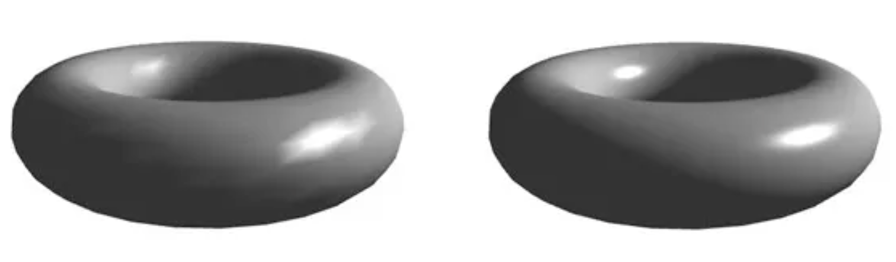

# GLSL Tutorial - 픽셀별 디렉셔널 라이트

| [목차](../../README.md) | 이전: [버텍스별 디렉셔널 라이트 2](./../30_directional_lights_per_vertex_2/30_directional_lights_per_vertex_2.md) | 다음: 포인트 라이트|
| :---------------------- | -------------------: | --------------: |

이전 섹션에서는 고러드 셰이딩에 대해 공부했습니다. 고러드 셰이딩은 픽셀별로 색상을 계산하고, 색상을 보간하여 프레그먼트에 보냅니다.

퐁(이전 섹션에서 specular 방정식을 만든 사람과 같은 사람입니다.)은 색상 보간 대신에 법선 벡터(그리고 다른 적절한 데이터)를 보간하여 프레그먼트별 실제 색상을 계산하는 방법을 제시했습니다. 이 방식은 퐁 셰이딩 모델로 알려져 있습니다. 완벽하지는 않지만, 렌더링 품질이 명확히 개선된 것을 아래에서 확인할 수 있습니다.

버텍스 셰이더에서는 보간될 데이터만 준비합니다. 그 다음, 프레그먼트 셰이더에서 프레그먼트별 색상을 계산합니다.

프레그먼트 셰이더는 색상을 계산하기 위해서 다음의 값을 프레그먼트별로 입력받아야 합니다:

- normal
- eye vector

버텍스 셰이더는 버텍스별 벡터를 계산/변환하여 보간된 값을 프레그먼트 셰이더에 전달해야 합니다. eye 벡터를 계산하기 위해서는 빛을 받는 지점에서 카메라로 향하는 벡터를 카메라 공간에서 계산해야 합니다.

$$Eye = Cam - point$$

$point$ 는 카메라 공간에서의 빛을 받는 지점의 좌표입니다. $point$ 를 계산하기 위해서 로컬 공간의 좌표에 뷰모델 행렬을 곱해주어야 합니다. 카메라 공간에서의 카메라는 원점에 위치하므로, eye 벡터는 다음과 같이 간단하게 구할 수 있습니다:

$$Eye = -m\_viewModel \times position$$

새 버텍스 셰이더입니다:

```glsl
#version 330

layout (std140) uniform Matrices {
    mat4 m_pvm;
    mat4 m_viewModel;
    mat3 m_normal;
};

in vec4 position;   // local space
in vec3 normal;     // local space

// the data to be sent to the fragment shader
out Data {
    vec3 normal;
    vec4 eye;
} DataOut;

void main() {
    DataOut.normal = normalize(m_normal * normal);
    DataOut.eye = -(m_viewModel * position);

    gl_Position = m_pvm * position;
}
```

빛의 방향은 더 이상 버텍스 셰이더에서 처리하지 않습니다. 모든 지점에 대해 방향이 일정하기 때문입니다(이건 결국 direction light입니다!). 일정하다는 것은 버텍스별로 계산하고 보간할 필요 없이 각 프레그먼트에 대한 값을 안다는 것을 의미합니다. 또한, 보간 후에 정확히 같은 값을 넘겨줄 것입니다. 그러므로 프레그먼트 셰이더에 값을 직접 전달할 수 있습니다.

대부분의 작업은 프레그먼트 셰이더에서 수행될 것입니다. 프레그먼트 셰이더는 보간된 법선 벡터와 eye 벡터를 받아서 색상을 계산합니다. 계산은 이전 섹션과 동일합니다.

```glsl
#version 330

layout (std140) uniform Materials {
    vec4 diffuse;
    vec4 ambient;
    vec4 specular;
    float shininess;
};

layout (std140) uniform Lights {
    vec3 l_dir;     // camera space
};

in Data {
    vec3 normal;
    vec4 eye;
} DataIn;

out vec4 colorOut;

void main() {
    // set the specular term to black
    vec4 spec = vec4(0.0);

    // normalize both input vectors
    vec3 n = normalize(DataIn.normal);
    vec3 e = normalize(vec3(DataIn.eye));

    float intensity = max(dot(n, l_dir), 0.0);

    // if the vertex is lit compute the specular color
    if (intensity > 0.0) {
        // compute the half vector
        vec3 h = normalize(l_dir + e);
        // compute the specular term into spec
        float intSpec = max(dot(h, n), 0.0);
        spec = specular * pow(intSpec, shininess);
    }
    colorOut = max(intensity * diffuse + spec, ambient);
}
```

이전 섹션의 고러드 셰이딩보다 더 훌륭한 결과를 얻을 수 있습니다. 왼쪽 그림은 버텍스별로 색상을 계산한 결과이고 오른쪽 그림은 프레그먼트별로 색상을 계산한 결과입니다.

<p align="center"></p>

| [목차](../../README.md) | 이전: [버텍스별 디렉셔널 라이트 2](./../30_directional_lights_per_vertex_2/30_directional_lights_per_vertex_2.md) | 다음: 포인트 라이트|
| :---------------------- | -------------------: | --------------: |

## 출처

http://www.lighthouse3d.com/tutorials/glsl-tutorial/directional-lights-per-pixel/