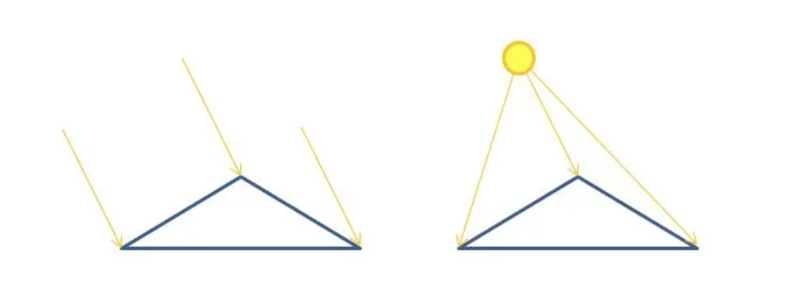
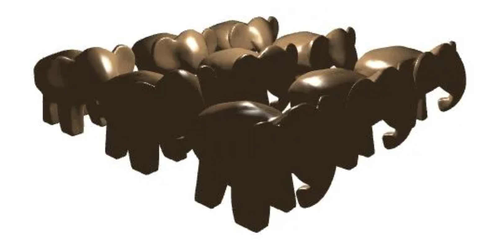

# GLSL Tutorial - 포인트 라이트

| [목차](../../README.md) | 이전: [픽셀별 디렉셔널 라이트](./../31_directional_lights_per_pixel/31_directional_lights_per_pixel.md) | 다음: [스팟 라이트](./../33_spotlights/33_spotlights.md)|
| :---------------------- | -------------------: | --------------: |

포인트 라이트를 다룰 때 [디렉셔널 라이트](http://www.lighthouse3d.com/tutorials/glsl-tutorial/directional-lights-per-pixel/) 와의 큰 차이점은 빛의 방향 대신에 위치를 고려한다는 것입니다. 이는 디렉셔널 라이트처럼 빛의 방향이 모든 프레그먼트/버텍스에서 일정하지 않음을 의미합니다. 그 외에는 모든 것이 디렉셔널 라이트와 같습니다. 아래 그림은 디렉셔널 라이트(왼쪽)에 의해 빛을 받는 삼각형과 포인트 라이트(오른쪽)에 의해 빛을 받는 삼각형입니다.

<p align="center"></p>

이제부터 버텍스 셰이더는 빛의 방향 대신에 빛의 위치를 받습니다. 그리고 각 버텍스별 빛의 방향을 계산해야 합니다. 빛의 위치는 카메라 공간의 좌표라고 가정합니다. 버텍스 좌표를 카메라 공간으로 이동하면 빛의 방향 계산이 간단해집니다:

$$light\ direction = light\ position - vertex\ position$$

따라서 빛 방향 벡터를 계산하기 전에 뷰모델 행렬 (셰이더의 `m_viewModel` uniform 변수) 을 버텍스 좌표에 곱해주어야 합니다.

새로운 버텍스 셰이더는 다음과 같습니다:

```glsl
#version 330

layout (std140) uniform Matrices {
    mat4 m_pvm;
    mat4 m_viewModel;
    mat3 m_normal;
};

layout (std140) uniform Lights {
    vec4 l_pos;
};

in vec4 position;
in vec3 normal;

out Data {
    vec3 normal;
    vec3 eye;
    vec3 lightDir;
} DataOut;

void main() {
    vec4 pos = m_viewModel * position;

    DataOut.normal = normalize(m_normal * normal);
    DataOut.lightDir = vec3(l_pos - pos);
    DataOut.eye = vec3(-pos);

    gl_Position = m_pvm * position;
}
```

프레그먼트 셰이더는 디렉셔널 라이트와 거의 비슷합니다. 한 가지 다른점은 보간된 빛의 방향을 입력으로 받는 것입니다.

```glsl
#version 330

out vec4 colorOut;

layout (std140) uniform Materials {
    vec4 diffuse;
    vec4 ambient;
    vec4 specular;
    float shininess;
};

in Data {
    vec3 normal;
    vec3 eye;
    vec3 lightDir;
} DataIn;

void main() {
    vec4 spec = vec4(0.0);

    vec3 n = normalize(DataIn.normal);
    vec3 l = normalize(DataIn.lightDir);
    vec3 e = normalize(DataIn.eye);

    float intensity = max(dot(n, l), 0.0);

    if (intensity > 0.0) {
        vec3 h = normalize(l + e);
        float intSpec = max(dot(h, n), 0.0);
        spec = specular * pow(intSpec, shininess);
    }
    
    colorOut = max(intensity * diffuse + spec, ambient);
}
```

아래의 그림은 포인트 라이트로 빛을 받는 씬의 예입니다.

<p align="center"></p>

| [목차](../../README.md) | 이전: [픽셀별 디렉셔널 라이트](./../31_directional_lights_per_pixel/31_directional_lights_per_pixel.md) | 다음: [스팟 라이트](./../33_spotlights/33_spotlights.md)|
| :---------------------- | -------------------: | --------------: |

## 출처

http://www.lighthouse3d.com/tutorials/glsl-tutorial/point-lights/