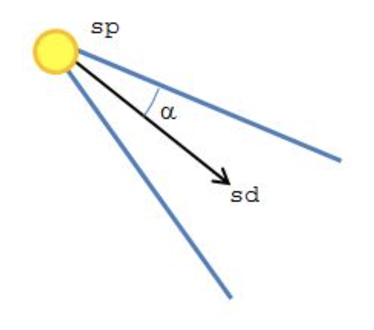

# GLSL Tutorial - 스팟 라이트

| [목차](../../README.md) | 이전: [포인트 라이트](./../32_point_lights/32_point_lights.md) | 다음: [텍스처 좌표 다루기](./../34_texture_coordinates/34_texture_coordinates.md) |
| :---------------------- | -------------------------------------------------------------: | --------------------------------------------------------------------------------: |

스팟 라이트는 제한된 [포인트 라이트](http://www.lighthouse3d.com/tutorials/glsl-tutorial/point-lights/)입니다. 즉, 스팟 라이트의 광선은 제한된 범위의 방향으로만 발산합니다. 이러한 제한을 정의하기 위해서는 일반적으로 원뿔을 사용합니다만 다른 도형도 가능합니다.

다음 그림은 원뿔 모양의 스팟 라이트와 관련 데이터를 보여줍니다.

<p align="center"></p>

- position: 원뿔의 꼭대기(sp)
- spot direction: 원뿔 축의 방향을 정의하는 벡터(sd)
- cutoff angle: 원뿔의 조리개. 각도가 방향 벡터에서 원뿔의 경계까지 측정된다고 가정($\alpha$)

버텍스 셰이더는 [포인트 라이트](http://www.lighthouse3d.com/tutorials/glsl-tutorial/point-lights/)와 거의 동일합니다. 아래 프레그먼트 셰이더의 light 블록을 버텍스 셰이더에 복사하면 잘 동작할 것입니다.

프레그먼트가 원뿔 안쪽에 있는지 판단하는 것은 프레그먼트 셰이더에서 처리합니다. 빛의 방향 벡터와 spotlight의 방향 벡터 사이의 각이 cufoff angle 보다 작다면 빛을 받습니다. 사실, 셰이더에서 아크코사인을 계산할 필요가 없도록 cutoff 값으로 각도 대신에 각의 코사인 값을 셰이더에 제공해야 합니다. 즉, 빛의 방향 벡터와 spot direction 사이의 내적 값이 cutoff 값보다 크면(코사인 값은 각도가 작을수록 값이 크므로), 올바르게 빛을 받습니다.

```glsl
#version 330

out vec4 colorOut;

layout (std140) uniform Materials {
    vec4 diffuse;
    vec4 ambient;
    vec4 specular;
    float shininess;
};

layout (std140) uniform Lights {
    vec4 l_pos, l_spotDir;
    float l_spotCutOff;
};

in Data {
    vec3 normal;
    vec3 eye;
    vec3 lightDir;
} DataIn;

void main() {
    float intensity = 0.0;
    vec4 spec = vec4(0.0);

    vec3 ld = normalize(DataIn.lightDir);
    vec3 sd = normalize(vec3(-l_spotDir));

    // inside the cone?
    if (dot(sd, ld) > l_spotCutOff) {
        vec3 n = normalize(DataIn.normal);
        intensity = max(dot(n, ld), 0.0);

        if (intensity > 0.0) {
            vec3 eye = normalize(DataIn.eye);
            vec3 h = normalize(ld + eye);
            float intSpec = max(dot(h, n), 0.0);
            spec = specular * pow(intSpec, shininess);
        }
    }
}
```

렌더링 결과는 다음과 같습니다.

<p align="center"></p>

| [목차](../../README.md) | 이전: [포인트 라이트](./../32_point_lights/32_point_lights.md) | 다음: [텍스처 좌표 다루기](./../34_texture_coordinates/34_texture_coordinates.md) |
| :---------------------- | -------------------------------------------------------------: | --------------------------------------------------------------------------------: |

## 출처

http://www.lighthouse3d.com/tutorials/glsl-tutorial/spotlights/
