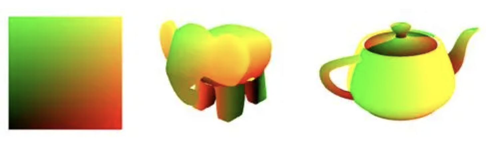
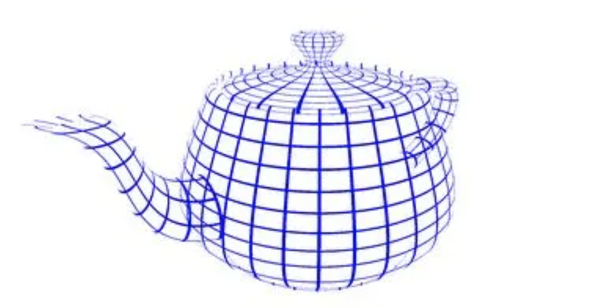
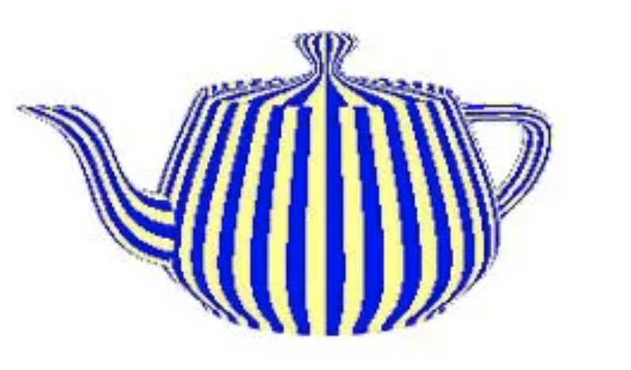
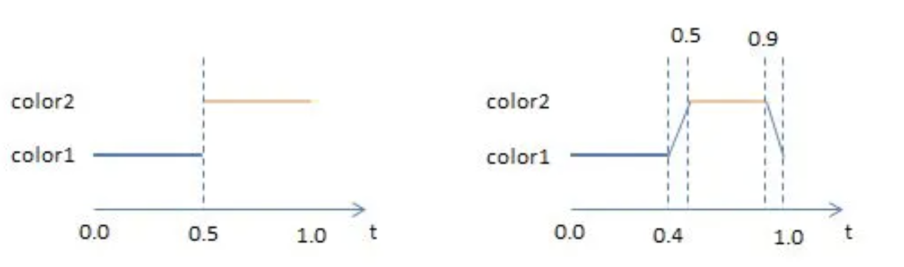
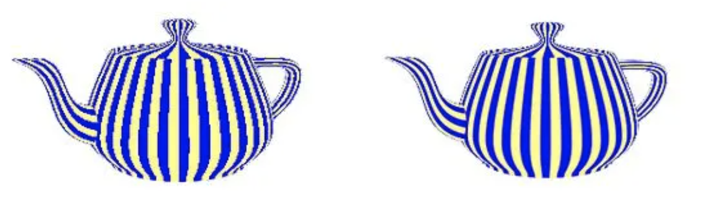
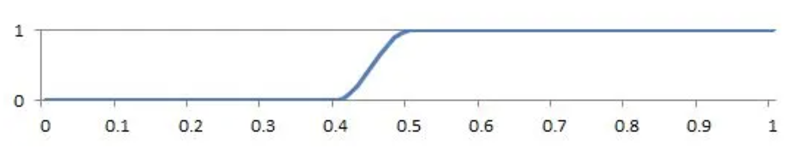
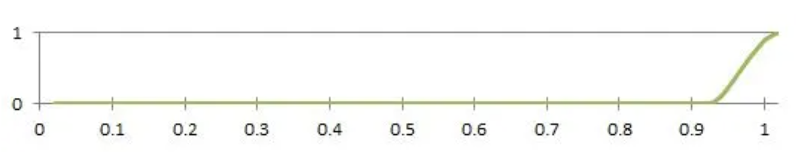
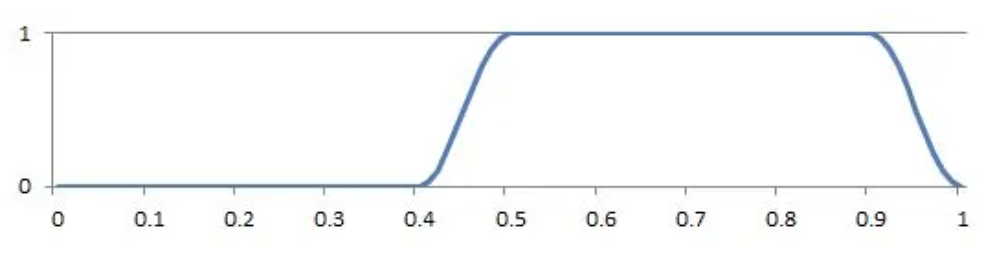

# GLSL Tutorial - 텍스처 좌표 다루기

| [목차](../../README.md) | 이전: 스팟 라이트 | 다음: 이미지 텍스처링 |
| :---------------------- | -------------------: | --------------: |

텍스처 좌표는 표면에 이미지를 어떻게 매핑하는지 정의하는데 주로 사용됩니다. 그러나 텍스처 좌표는 매핑 작업에 국한되어있지 않습니다. 텍스처 좌표 그 자체로 모델의 색상으로 사용될 수 있습니다. 이제부터 텍스처 좌표를 자체적으로 사용하는 몇 가지 예시를 살펴볼 것입니다.

먼저 셰이더에서 텍스처 좌표를 사용할 수 있도록 코드를 작성합니다. 텍스처 좌표는 법선과 마찬가지로 버텍스 어트리뷰트 중 하나입니다. 그러므로 다른 모든 모델 어트리뷰트가 담긴 버텍스 어레이 오브젝트에 텍스처 좌표가 포함된 버퍼를 추가해야 합니다 (어트리뷰트에 대한 자세한 내용은 [이 색션](../19_attribute_variables/19_attribute_variables.md)을 참고하세요).

버텍스 셰이더에서 텍스처 좌표를 입력으로 받을 수 있습니다. 입력으로 받은 뒤, 보통 단순하게 출력 변수로 복사하여 내보냅니다. 이 변수는 어플리케이션의 목적에 받는 프레그먼트 셰이더에서 입력으로 받을 수 있습니다.

지금까지 설명한 내용을 아래의 코드에서 확인할 수 있습니다:

버텍스 셰이더

```glsl
#version 330

uniform mat4 pvm;

in vec4 position;
in vec2 texCoord;

out vec2 texCoordV;

void main() {
    texCoordV = texCoord;
    gl_Position = pvm * position;
}
```

프레그먼트 셰이더

```glsl
#version 330

in vec2 texCoordV;

out vec4 colorOut;

void main() {
    colorOut = vec4(texCoord, 0.0, 0.0);
}
```

이러한 셰이더 출력은 텍스처 좌표를 색상으로 표시하여 모델에서 텍스처 매핑이 어떻게 정의되는지 보여줍니다. 예를 들어, 아래에 텍스처 좌표가 적용된 평면, 코끼리, 주전자가 있습니다. 빨간색은 s 좌표, 초록색은 t 좌표로 사용됩니다. 이 셰이더는 예상치 않은 이미지 텍스처링을 디버깅하는데 유용합니다.

<p align="center"></p>

**텍스처 좌표 가지고 놀기**

텍스처 좌표는 몇 가지 흥미로운 효과에 사용될 수도 있습니다. 예를 들어, 아래 그림과 같은 그리드 효과를 표현하고 싶다고 가정하면:

<p align="center"></p>

파란색 픽셀들을 그리고 GLSL 키워드 `discard` 를 사용하여 나머지 픽셀들을 제거하면 됩니다. 그리드의 밀도는 multiplication factor(곱셈 인자)를 텍스처 좌표에 곱하여 정의합니다. 프레그먼트 셰이더는 텍스처 좌표의 소수점 이하의 값이 0.1보다 작은 픽셀들을 선택하고 파란색으로 칠합니다. threshold 변수 값 0.1은 그려진 선의 두께를 조절합니다.

버텍스 셰이더는 위의 코드와 동일하고 프레그먼트 셰이더만 다시 작성하겠습니다. 줄무늬 multiplication factor를 8로 설정합니다. multiplication factor와 threshold를 값을 바꾸면 그리드 셀의 수와 너비가 각각 변경됩니다.

```glsl
#version 330

uniform int multiplicationFactor = 8;
uniform float threshold = 0.1;

in vec2 texCoordV;
out vec4 colorOut;

void main() {
    // multiplicationFactor scales the number of stripes
    vec2 t = texCoordV * multiplicationFactor;

    // the threshold constant defines the width of the lines
    if (fract(t.s) < threshold || fract(t.t) < threshold)
        colorOut = vec4(0.0, 0.0, 1.0, 1.0);
    else
        discard;
}
```

`discard` 키워드는 해당 프레그먼트를 제거합니다. 그러면 셰이더가 중지되고 컬러와 깊이 버퍼에 아무것도 입력되지 않습니다.

또 다른 흥미로운 예는 텍스처 좌표를 바탕으로 색상을 선택하는 것입니다. 오브젝트에 줄무늬를 그리는 셰이더를 작성할 수 있습니다. 셰이더는 텍스처 좌표의 소수점 이하의 값을 기반으로 어떤 색상을 사용하는지 결정합니다. 예를 들어 s 좌표의 소수점 이하의 값이 0.5보다 작은 경우에 셰이더는 한 가지 색상을 선택하고 다른 경우에는 다른 색상을 선택합니다.

프레그먼트 셰이더만 다시 작성합니다.

```glsl
#version 330

uniform vec4 color1 = vec4(0.0, 0.0, 1.0, 1.0);
uniform vec4 color2 = vec4(1.0, 1.0, 0.5, 1.0);

uniform int multiplicationFactor = 8;

in vec2 texCoordV;

out vec4 outputF;

void main() {
    if (fract(texCoordV.s * multiplicationFactor) < 0.5)
        outputF = vec4(0.0, 0.0, 1.0, 1.0);
    else
        outputF = vec4(1.0, 1.0, 0.5, 1.0);
}
```

<p align="center"></p>

렌더링 결과 계단 현상(Aliasing)이 심하게 발생합니다! step 함수를 색상 함수로 사용하기 때문입니다. 계단 현상을 해결하기 위해서는 아래 그림과 같이 값이 부드럽게 변하는 함수를 사용해야 합니다.

<p align="center"></p>

프레그먼트 셰이더에서 이 함수를 구현하는건 매우 간단합니다. 아래 그림과 같이 색상을 선형 보간을 수행하기 위해서 GLSL mix 함수를 사용할 것입니다. mix 함수의 앞 두 매개변수는 섞이는 색상들입니다. 그리고 마지막 매개변수는 다음 수식에 따라 어떻게 색상을 섞을 것인지 지정합니다:

$$mix(color1,\ color2,\ f) = color2 \times f + color1 \times (1 - f)$$

프레그먼트 셰이더는 다음과 같이 작성합니다:

```glsl
#version 330

uniform vec4 color1 = vec4(0.0, 0.0, 1.0, 1.0);
uniform vec4 color2 = vec4(1.0, 1.0, 0.5, 1.0);
in vec2 texCoordV;

out vec4 colorOut;

void main() {
    vec2 t = texCoordV * 8.0;

    float f = fract(t.s);

    if (f < 0.4)
        colorOut = color1;
    else if (f < 0.5)
        colorOut = mix(color1, color2, (f - 0.4) * 10.0);
    else if (f < 0.9)
        colorOut = color2;
    else
        colorOut = mix(color2, color1, (f - 0.9) * 10.0);
}
```

아래 그림을 살펴보면, 오른쪽 주전자가 왼쪽 주전자보다 계단 현상이 개선된 것을 확인할 수 있습니다.

<p align="center"></p>

GLSL에는 위와 동일한 효과를 생성하는 `smoothstep` 함수가 있습니다. 이 함수는 세 가지 파라미터를 받습니다: 아래쪽 경계(edge0), 위쪽 경계(edge1), 보간할 값

의사 코드:

```
if (x <= edge0)
    return 0.0;
else if (x >= edge1)
    return 1.0;
else {
    t = (x - edge0) / (edge1 - edge0);
    return 3.0 * t ^ 3 - 2.0 * t ^ 2;
}
```

`smoothstep` 함수는 edge0 ~ edge1 범위에서 0과 1의 사이의 값으로 에르미트 보간(Hermite interpolation)을 수행합니다(부드러운 3차 곡선).

`smoothstep` 함수를 서로 다른 매개변수로 호출하여 얻은 두 가지 곡선 예시가 있습니다.

`f = smoothstep(0.4, 0.5, x);`

<p align="center"></p>

`f = smoothstep(0.9, 1.0, x);`

<p align="center"></p>

위의 곡선들은 만들고자 하는 곡선이 아닙니다. 하지만 두 개의 `smoothstep`을 다음과 같이 조합하면 원하는 곡선을 정확하게 만들 수 있습니다:

`f = smoothstep(0.4, 0.5, t.s) - smoothstep(0.9, 1.0, t.s;`

<p align="center"></p>

결과값 `f` 는 최종 색상을 선택하는 `mix` 함수의 매개변수로 사용할 수 있습니다. 프레그먼트 셰이더는 다음과 같이 작성할 수 있습니다:

```glsl
#version 330

uniform vec4 color1 = vec4(0.0, 0.0, 1.0, 1.0);
uniform vec4 color2 = vec4(1.0, 1.0, 0.5, 1.0);

uniform int multiplicationFactor = 8;

in vec2 texCoordV;
out vec4 outputF;

void main() {
    float x = fract(texCoordV.s * 8.0);
    float f = smoothstep(0.4, 0.5, x) - smoothstep(0.9, 1.0, x);
    outputF = mix(color2, color1, f);
}
```

| [목차](../../README.md) | 이전: 스팟 라이트 | 다음: 이미지 텍스처링 |
| :---------------------- | -------------------: | --------------: |

## 출처

http://www.lighthouse3d.com/tutorials/glsl-tutorial/texture-coordinates/
