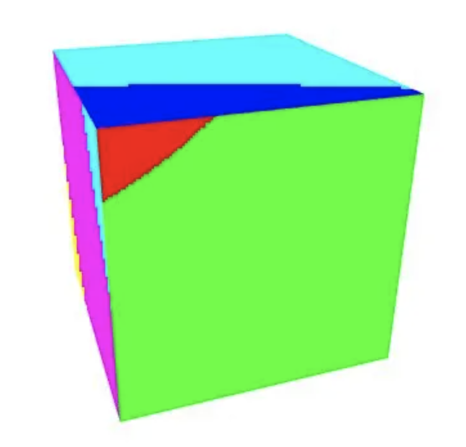
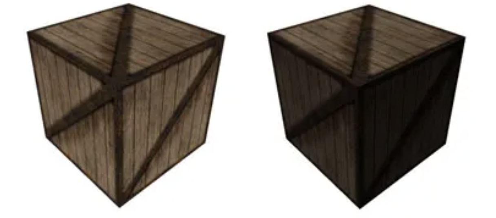

# GLSL Tutorial - 이미지 텍스처링

| [목차](../../README.md) | 이전: [텍스처 좌표 다루기](../34_texture_coordinates/34_texture_coordinates.md) |
| :---------------------- | -------------------: | --------------: |

대체로 텍스처는 폴리곤 메시에 입히려고 하는 이미지입니다. 마치 벽에 벽지를 붙히는 것과 같습니다. 때때로 텍스처는 색상이 아닌 데이터로 볼 수 있습니다. 텍스처 좌표는 이미지와 폴리곤 메시 사이의 매핑에 사용합니다. 어플리케이션 내부에서 텍스처를 사용하려면 셰이더에서 실제로 텍스처를 사용하기 전에 OpenGL에서 몇 가지 설정을 해야합니다. 이 섹션에서는 몇 가지 대표적인 텍스처 사용법을 다룰 것입니다.

**OpenGL**

셰이더에서 텍스처를 사용하려면 우선 OpenGL 텍스처 오브젝트를 생성해야 합니다. 그리고 일반적으로 파일에서 이미지를 로드하여 텍스처에 데이터를 저장해야 합니다. 어떻게 해야하는지 모르겠다면 [이 페이지](http://www.lighthouse3d.com/cg-topics/code-samples/loading-an-image-and-creating-a-texture/)를 보세요.

셰이더 설정은 텍스처 유닛을 지정하는 uniform이 필요합니다. 셰이더가 텍스처 네임이 아닌 텍스처 유닛을 받는다는 것에 주의하세요. OpenGL은 다수의 텍스처 유닛을 제공합니다. 그렇기 때문에 셰이더에서 하나 이상의 텍스처를 사용할 수 있습니다. 사용 가능한 텍스처 유닛의 전체 개수는 `GL_MAX_COMBINED_TEXTURE_IMAGE_UNITS` 으로 구할 수 있습니다.

셰이더에 uniform 변수 `texUnit` 을 선언하고, 텍스처 유닛 0에 바인딩될 텍스처 1개를 갖는다고 가정합니다.

어플리케이션의 OpenGL 측에서는 uniform 변수 `texUnit`의 로케이션을 가져오는 설정이 필요합니다. OpenGL에서 `texUnit` 은 정수값입니다. 변수 `p` 가 GLSL 프로그램의 네임이라고 가정하면, 아래와 같이 `texUnit` 의 로케이션을 얻을 수 있습니다.

```c
GLint texUnitLoc = glGetUniformLocation(p, "texUnit");
```

셰이더에 입력되는 텍스처 유닛이 항상 동일하다면 어플리케이션 설정 단계에서 설정할 수 있습니다. 그렇지 않다면 텍스처 유닛이 변경될 때마다 설정해주어야 합니다. texUnit 변수에 텍스처 유닛 0을 설정하려면 다음과 같이 작성합니다:

```c
glProgramUniform1i(p, texUnitLoc, 0);
```

렌더링을 수행하려면 텍스처를 텍스처 유닛에 바인딩해야합니다. 그러므로 `textureID` 는 텍스처 네임(`glGenTextures` 로 생성된)이고 텍스처는 2D라고 가정하면, 다음과 같이 작성할 수 있습니다:

```c
glActiveTexture(GL_TEXTURE0);
glBindTexture(GL_TEXTURE_2D, textureID);
```

그 후에 VAO를 바인딩하고 glDraw* 명령어를 호출합니다.

**GLSL**

이제, GLSL 쪽으로 가보겠습니다. 먼저 texUnit 변수를 선언해야 합니다. 변수는 `sampler*` 타입으로 선언됩니다. sampler는 불투명한(opaque) 타입입니다. 즉, 보통의 변수처럼 접근할 수 없고, 알맞은 함수를 사용하여 접근해야 합니다. 텍스처 데이터로부터 값을 받아오는 함수를 통해 sampler는 어플리케이션의 OpenGL 쪽에서 정의된 텍스처에 접근을 허용합니다. 각 텍스처 타입은 알맞은 sampler 타입을 가집니다. 예를 들어, 텍스처 타겟 `GL_TEXTURE_2D` 의 sampler 타입은 `sampler2D` 입니다.

텍스처에 접근하려면 두 가지가 필요합니다: 텍스처 유닛과 텍스처 좌표입니다. 텍스처 데이터에 접근하기 위한 몇 가지 함수가 있습니다. 일부는 쿼리 함수이고 다른 일부는 텍스처 데이터를 제공합니다.

일반적인 셰이더는 다양한 크기의 텍스처를 처리할 수 있습니다. 크기 정보(너비와 높이)는 uniform 변수를 통해 셰이더에 제공됩니다. 또 다른 방법은 `textureSize` 함수를 사용하는 것입니다. 이 함수는 x, y z 요소의 텍스처 크기를 반환합니다. 그리고 w는 텍스처 어레이 또는 큐브맵을 사용할 때의 인덱스입니다. 또한 이 함수는 밉맵 레벨을 받을 수도 있습니다. 이 경우에 위의 모든 정보는 요청된 밉맵 레벨에 대한 정보입니다.

텍스처 밉맵 레벨 수는 `textureQueryLevels` 로 쿼리할 수 있습니다. 이 함수는 텍스처에서 사용 가능한 밉맵 레벨의 수를 반환합니다(OpenGL 4.3부터 사용가능).

특정 프레그먼트에 사용되는 밉맵 레벨 또는 밉맵 레벨의 조합은 `textureQueryLod` 를 사용하여 얻을 수 있습니다. 이 함수는 사용되는 레벨과 비율을 나타내는 x 요소가 담긴 vec2를 반환합니다. 예를 들어 x = 3.25이면 레벨 3이 75%이고 레벨 4가 25%입니다.

실제로 확인할 수 있습니다. 다음 코드를 보세요:

```glsl
#version 420

uniform sampler2D texUnit;
out vec4 outputF;

void main() {
    vec2 res = textureQueryLod(texUnit, VertexIn.texCoord.xy);

    if (res.x == 0)
        outputF = vec4(1.0, 0.0, 0.0, 0.0);
    else if (res.x < 1)
        outputF = vec4(0.0, 1.0, 0.0, 0.0);
    else if (res.x < 2)
        outputF = vec4(0.0, 0.0, 1.0, 0.0);
    else if (res.x < 3)
        outputF = vec4(0.0, 1.0, 1.0, 0.0);
    else if (res.x < 4)
        outputF = vec4(1.0, 0.0, 1.0, 0.0);
    else if (res.x < 5)
        outputF = vec4(1.0, 1.0, 0.0, 0.0);
    else if (res.x < 6)
        outputF = vec4(0.5, 1.0, 0.0, 0.0);
    else if (res.x < 7)
        outputF = vec4(0.0, 1.0, 0.5, 0.0);                                
}
```

결과는 다음 그림과 같습니다:

<p align="center"></p>

**Retrieving the texture data**

실제로 텍스처 데이터를 불러와서 폴리곤 메시에 색상을 지정하려면 두 가지 함수를 사용할 수 있습니다: `texture` 와 `texelFetch`. texture 함수는 매개변수로 0과 1사이의 텍스처 좌표를 받거나 텍스처 좌표가 반복되는 경우에는 소수점 이하 부분을 받습니다. 이것은 상대적인 텍스처 좌표입니다. Fetching, on the other hand, takes integer texture coordinates, as the line and column of the pixel. No linear filtering is performed, a single texel is retrieved.

텍스처 데이터를 얻으면 최종 색상으로 사용하거나 [여기](http://www.lighthouse3d.com/tutorials/glsl-tutorial/lighting/)서 계산된 반사 강도(reflected intensity)로 변조할 수 있습니다. 아래 그림은 위의 시나리오에 대한 결과입니다(왼쪽: 텍스처만 적용, 오른쪽: 텍스처에 변조 적용).

<p align="center"></p>

텍스처 색상은 픽셀의 머티리얼과 조합될 수 있습니다. 예를 들어, 텍스처링이 적용된 디렉셔널 라이트 셰이더([여기](http://www.lighthouse3d.com/tutorials/glsl-tutorial/directional-lights-per-pixel/)를 보세요)는 다음과 같이 작성할 수 있습니다:

버텍스 셰이더: 텍스처 좌표가 버텍스 속성으로 추가됩니다. 텍스처 좌표는 버텍스 셰이더를 그냥 통과합니다.

```glsl
#version 330

layout (std140) uniform Matrices {
    mat4 m_pvm;
    mat4 m_viewModel;
    mat3 m_normal;
};

layout (std140) uniform Lights {
    vec3 l_dir;     // camera space
};

in vec4 position;   // local space
in vec3 normal;     // local space
// 추가
in vec2 texCoord;

// the data to be sent to the fragment shader
out Data {
    vec3 normal;
    vec4 eye;
    // 추가
    vec2 texCoord;
} DataOut;

void main() {
    DataOut.normal = normalize(m_normal * normal);
    DataOut.eye = -(m_viewModel * position);
    // 추가
    DataOut.texCoord = texCoord;

    gl_Position = m_pvm * position;
}
```

프레그먼트 셰이더: sampler가 추가됩니다. 텍스처 좌표는 `texture` 함수에서 색상을 얻는데 사용됩니다.

```glsl
#version 330

layout (std140) uniform Material {
    vec4 diffuse;
    vec4 ambient;
    vec4 specular;
    float shininess;
};

layout (std140) uniform Lights {
    vec3 l_dir;     // camera space
};

in Data {
    vec3 normal;
    vec4 eye;
    // 추가
    vec2 texCoord;
} DataIn;

// 추가
uniform sampler2D texUnit;

out vec4 colorOut;

void main() {
    // set the specular term to black
    vec4 spec = vec4(0.0);

    // normalize both input vectors;
    vec3 n = normalize(DataIn.normal);
    vec3 e = normalize(vec3(DataIn.eye));

    float intensity = max(dot(n, l_dir), 0.0);

    // if the vertex is lit compute the specular color
    if (intensity > 0.0) {
        // compute the half vector
        vec3 h = normalize(l_dir + e);
        // compute the specular term into spec
        float intSpec = max(dot(h, n), 0.0);
        spec = specular * pow(intSpec, shininess);
    }
    // 추가
    vec4 texColor = texture(texUnit, DataIn.texCoord);
    vec4 diffColor = intensity * diffuse * texColor;
    vec4 ambColor = ambient * texColor;

    colorOut = max(diffColor + spec, ambColor);
}
```

diffuse와 ambient 색상만 텍스처와 조합되는 것을 주의하세요. specular 효과는 텍스처의 영향을 받지 않습니다.

**NOTE**

sampler가 배열이라면, hen the samplers can only be indexed with a dynamically uniform integral expression. 이것은 실행중인 셰이더의 모든 인스턴스에서 이 인덱스가 상수이어야 함을 의미합니다.

동일한 인덱스를 사용하기 때문에 아래의 코드는 가능합니다:

```glsl
uniform int anIndex;
uniform sampler2D myTexture[3];

in vec2 texCoord;

void main() {
    ...
    color = texture(myTexture[anIndex], texCoord);
    ...
}
```

다음은 문제가 발생하는 예시입니다. y 스크린 좌표가 기준 이하이면 하나의 텍스처를 선택하고 기준을 넘으면 다른 텍스처를 선택하길 원한다고 가정합니다.

```glsl
uniform int anIndex;
uniform sampler2D myTexture[3];

in vec2 texCoord;

void main() {
    ...
    if (gl_FragCoord.y > 100.0)
        index = 0;
    else
        index = 1;
    
    color = texture(myTexture[index], texCoord);
    ...
}
```

| [목차](../../README.md) | 이전: [텍스처 좌표 다루기](../34_texture_coordinates/34_texture_coordinates.md) |
| :---------------------- | -------------------: | --------------: |

## 출처

http://www.lighthouse3d.com/tutorials/glsl-tutorial/texturing-with-images/
